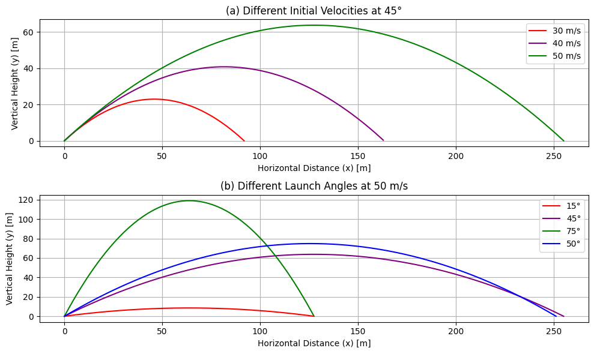

# Problem 1
# Theoretical Foundation

## Derivation of Governing Equations of Motion

Projectile motion is governed by Newton's Second Law:

$F=ma$

In the absence of air resistance, the only force acting on a projectile is gravity. Assuming motion in two dimensions (horizontal $x$ and vertical $y$), we express the acceleration components as:

$a_x=0,\quad a_y=-g$

where $g$ is the acceleration due to gravity.

Using kinematic equations:

$v=v_0+at$

$s=s_0+v_0t+\frac{1}{2}at^2$

For horizontal motion:

$v_x=v_0\cos\theta$

$x=v_0\cos\theta\cdot t$

For vertical motion:

$v_y=v_0\sin\theta-gt$

$y=v_0\sin\theta\cdot t-\frac{1}{2}gt^2$

where:
- $v_0$ is the initial velocity,
- $\theta$ is the launch angle,
- $t$ is time.

## Solving the Basic Differential Equations

The motion of the projectile can also be described using differential equations:

$$\frac{d^2x}{dt^2}=0,\quad\frac{d^2y}{dt^2}=-g$$

Integrating both equations:

$$\frac{dx}{dt}=v_0\cos\theta$$

$$\frac{dy}{dt}=v_0\sin\theta-gt$$

A second integration gives the position equations:

$$x(t)=v_0\cos\theta\cdot t$$

$$y(t)=v_0\sin\theta\cdot t-\frac{1}{2}gt^2$$

## Effect of Initial Conditions on Trajectory

### Time of Flight

Setting $y=0$ to find the total flight time:

$$v_0\sin\theta\cdot t-\frac{1}{2}gt^2=0$$

Solving for $t$:

$$t=\frac{2v_0\sin\theta}{g}$$

### Maximum Height

At the peak of the motion, $v_y=0$:

$$0=v_0\sin\theta-gt_{max}$$

Solving for $t_{max}$:

$$t_{max}=\frac{v_0\sin\theta}{g}$$

Substituting into the vertical position equation:

$$H=\frac{(v_0\sin\theta)^2}{2g}$$

### Range of the Projectile

The range $R$ is given by:

$$R=v_0\cos\theta\cdot t_{total}$$

Substituting $t_{total}=\frac{2v_0\sin\theta}{g}$:

$$R=\frac{v_0^2\sin2\theta}{g}$$

### Observations

- The range is maximized at $\theta=45^\circ$.
- Doubling the initial velocity quadruples the range.
- Increasing $g$ decreases the range.

These equations provide a foundation for further analysis, including air resistance and varying gravitational fields.


# **Analysis of the Range**

## **Dependence of Range on Angle of Projection**

The range $R$ of a projectile launched with an initial velocity $v_0$ at an angle $heta$ from the horizontal is given by the equation:

$$R = \frac{v_0^2 \sin 2\theta}{g}$$

where:
- $v_0$ is the initial velocity,
- $heta$ is the angle of projection,
- $g$ is the acceleration due to gravity.

### **Analysis:**
- The range $R$ is maximized when $\sin 2	heta = 1$, which occurs at $2	heta = 90^\circ$, or $heta = 45^\circ$.
- For angles $heta > 45^\circ$ or $heta < 45^\circ$, the range decreases.
- The function $\sin 2	heta$ is symmetric about $45^\circ$, meaning that angles $heta$ and $90^\circ - 	heta$ produce the same range.

## **Effect of Initial Velocity and Gravitational Acceleration on Range**

Since the range equation is:

$$R = \frac{v_0^2 \sin 2\theta}{g},$$

we can analyze the influence of $v_0$ and $g$:

### **Effect of Initial Velocity $v_0$:**

$$\frac{dR}{dv_0} = \frac{2 v_0 \sin 2\theta}{g} > 0$$

- The range $R$ increases quadratically with $v_0$, meaning that doubling the initial velocity results in a fourfold increase in range.

### **Effect of Gravitational Acceleration $g$:**

$$\frac{dR}{dg} = -\frac{v_0^2 \sin 2\theta}{g^2} < 0$$

- The range $R$ is inversely proportional to $g$, meaning that increasing gravity decreases the range.
- On celestial bodies with lower $g$ (e.g., the Moon), the projectile travels much farther.

## **Conclusion**
- The range depends on both the angle and the initial velocity.
- The maximum range occurs at $45^\circ$.
- Increasing the initial velocity significantly increases the range.
- A higher gravitational acceleration reduces the range.

These principles are crucial in physics, engineering, and ballistics, influencing projectile motion analysis in various fields.


# **Practical Applications of Differential Equations**

## **1. Suspension Bridges**

Suspension bridges are modeled using second-order differential equations that describe the motion and forces acting on the structure. A common equation used in modeling is:

$$EI\frac{d^4y}{dx^4}=q(x)$$

where:
- $E$ is the Young’s modulus,
- $I$ is the second moment of area,
- $y(x)$ is the deflection of the bridge deck,
- $q(x)$ represents the distributed load.

The natural frequency of oscillation is given by:

$$\omega_n=\sqrt{\frac{k}{m}}$$

where $k$ is the stiffness of the cables and $m$ is the mass per unit length.

## **2. Energy Harvesting Systems**

Energy harvesting systems use vibrational energy to generate power, often modeled as a damped harmonic oscillator:

$$m\frac{d^2x}{dt^2}+c\frac{dx}{dt}+kx=F(t)$$

where:
- $m$ is the mass of the system,
- $c$ is the damping coefficient,
- $k$ is the stiffness,
- $F(t)$ represents the external driving force.

A piezoelectric harvester converts mechanical energy into electrical energy, where the governing equation includes an electromechanical coupling term:

$$M\ddot{X}+C\dot{X}+KX=\alpha V$$ 

$$C_e\dot{V}+GV=\alpha\dot{X}$$

where $V$ is the voltage generated and $\alpha$ is the coupling coefficient.

## **3. Driven RLC Circuits**

An RLC circuit, consisting of a resistor $R$, inductor $L$, and capacitor $C$, is governed by:

$$L\frac{d^2q}{dt^2}+R\frac{dq}{dt}+\frac{q}{C}=V(t)$$

where $q$ is the charge and $V(t)$ is an external driving voltage.

For an AC-driven circuit:

$$V(t)=V_0\cos(\omega t)$$

The steady-state solution is given by:

$$I(t)=I_0\cos(\omega t-\phi)$$

where the phase shift $\phi$ is determined by:

$$\tan\phi=\frac{\omega L-\frac{1}{\omega C}}{R}$$

These applications illustrate the fundamental role of differential equations in engineering and physics, governing complex systems from mechanical oscillations to electrical circuits.


###  4  phyton /plot




```python
import numpy as np
import matplotlib.pyplot as plt

# Constants
g = 9.8  # Acceleration due to gravity (m/s^2)

# Function to calculate the trajectory
def calculate_trajectory(v0, theta_deg):
    theta_rad = np.radians(theta_deg)  # Convert angle to radians
    t_max = 2 * v0 * np.sin(theta_rad) / g  # Total time of flight
    t = np.linspace(0, t_max, 500)  # Time array
    
    # Calculate x and y coordinates
    x = v0 * np.cos(theta_rad) * t
    y = v0 * np.sin(theta_rad) * t - 0.5 * g * t**2
    
    # Filter out points where y < 0
    valid_indices = y >= 0
    x = x[valid_indices]
    y = y[valid_indices]
    
    return x, y

# Part (a): Different Initial Velocities at 45°
plt.figure(figsize=(10, 6))
plt.subplot(2, 1, 1)
initial_velocities = [30, 40, 50]
colors = ['red', 'purple', 'green']
labels = ['30 m/s', '40 m/s', '50 m/s']

for v0, color, label in zip(initial_velocities, colors, labels):
    x, y = calculate_trajectory(v0, 45)
    plt.plot(x, y, label=label, color=color)

plt.xlabel('Horizontal Distance (x) [m]')
plt.ylabel('Vertical Height (y) [m]')
plt.title('(a) Different Initial Velocities at 45°')
plt.legend()
plt.grid(True)

# Part (b): Different Launch Angles at 50 m/s
plt.subplot(2, 1, 2)
launch_angles = [15, 45, 75, 50]
colors = ['red', 'purple', 'green', 'blue']
labels = ['15°', '45°', '75°', '50°']

for theta, color, label in zip(launch_angles, colors, labels):
    x, y = calculate_trajectory(50, theta)
    plt.plot(x, y, label=label, color=color)

plt.xlabel('Horizontal Distance (x) [m]')
plt.ylabel('Vertical Height (y) [m]')
plt.title('(b) Different Launch Angles at 50 m/s')
plt.legend()
plt.grid(True)

plt.tight_layout()
plt.show()
```

## Colab
[Colab](https://colab.research.google.com/drive/1R8uP7tOEooSSDNhfp65kFBhZ6K9hYZJQ?authuser=0#scrollTo=DsfumtOCw_EM)