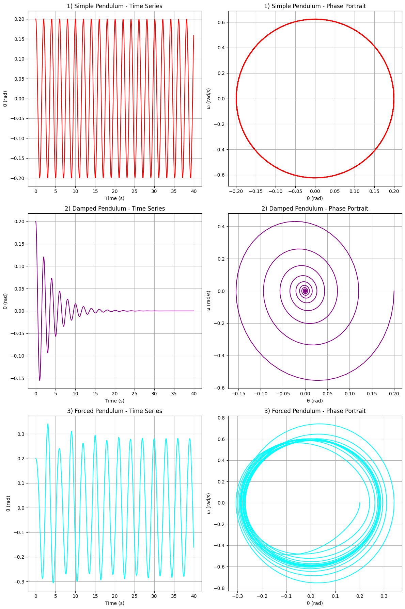

# Problem 2
# 1. Theoretical Foundation

## 1.1 Governing Equation: Forced Damped Pendulum

Consider a pendulum of length $L$ and mass $m$ subject to damping and an external periodic driving force. Let $\theta(t)$ be the angular displacement from the vertical.

The torque $\tau$ acting on the pendulum includes:

- **Restoring torque**: $-mgL \sin(\theta)$
- **Damping torque**: $-b \dot{\theta}$, where $b$ is the damping coefficient
- **Driving torque**: $F_0 \cos(\omega t)$, where $F_0$ is the forcing amplitude and $\omega$ is the driving frequency

Using Newton’s second law for rotational motion:

$$
I \ddot{\theta} = -mgL \sin(\theta) - b \dot{\theta} + F_0 \cos(\omega t)
$$

For a simple pendulum, the moment of inertia about the pivot is $I = mL^2$, hence:

$$
mL^2 \ddot{\theta} + b \dot{\theta} + mgL \sin(\theta) = F_0 \cos(\omega t)
$$

Dividing through by $mL^2$:

$$
\ddot{\theta} + \frac{b}{mL^2} \dot{\theta} + \frac{g}{L} \sin(\theta) = \frac{F_0}{mL^2} \cos(\omega t)
$$

Define:

- $\gamma = \frac{b}{mL^2}$ (damping ratio)
---
- $\omega_0^2 = \frac{g}{L}$ (natural frequency squared)
---
- $f = \frac{F_0}{mL^2}$ (normalized driving amplitude)

Then the equation becomes:

$$
\ddot{\theta} + \gamma \dot{\theta} + \omega_0^2 \sin(\theta) = f \cos(\omega t)
$$

This is the **nonlinear second-order differential equation** governing a **forced damped pendulum**.

---

## 1.2 Small-Angle Approximation and Linearization

For **small angular displacements**, we use the approximation:

$$
\sin(\theta) \approx \theta
$$

Then the equation reduces to a **linear differential equation**:

$$
\ddot{\theta} + \gamma \dot{\theta} + \omega_0^2 \theta = f \cos(\omega t)
$$

This is a **linear nonhomogeneous second-order ODE** with constant coefficients.

### Homogeneous Solution:

Solve:

$$
\ddot{\theta} + \gamma \dot{\theta} + \omega_0^2 \theta = 0
$$

Assume solution of the form $\theta(t) = e^{\lambda t}$:

$$
\lambda^2 + \gamma \lambda + \omega_0^2 = 0
$$

The characteristic equation has roots:

$$
\lambda = \frac{-\gamma \pm \sqrt{\gamma^2 - 4 \omega_0^2}}{2}
$$

The behavior depends on the discriminant $\Delta = \gamma^2 - 4\omega_0^2$:

- **Underdamped** $(\gamma^2 < 4\omega_0^2)$: oscillatory decay
- **Critically damped** $(\gamma^2 = 4\omega_0^2)$: fastest non-oscillatory decay
- **Overdamped** $(\gamma^2 > 4\omega_0^2)$: slow non-oscillatory decay

---

## 1.3 Steady-State Solution and Resonance

We seek a particular solution of the form:

$$
\theta_p(t) = A \cos(\omega t - \delta)
$$

Substitute into the linearized equation:

$$
\ddot{\theta}_p + \gamma \dot{\theta}_p + \omega_0^2 \theta_p = f \cos(\omega t)
$$

Compute derivatives:

- $\dot{\theta}_p = -A \omega \sin(\omega t - \delta)$
- $\ddot{\theta}_p = -A \omega^2 \cos(\omega t - \delta)$

Substitute and equate coefficients:

$$
-A \omega^2 \cos(\omega t - \delta) - \gamma A \omega \sin(\omega t - \delta) + \omega_0^2 A \cos(\omega t - \delta) = f \cos(\omega t)
$$

Using phasor (complex) representation or matching coefficients:

$$
A = \frac{f}{\sqrt{(\omega_0^2 - \omega^2)^2 + \gamma^2 \omega^2}}
$$

$$
\tan(\delta) = \frac{\gamma \omega}{\omega_0^2 - \omega^2}
$$

---

## 1.4 Resonance Analysis

**Resonance** occurs when the driving frequency $\omega$ approaches the system's natural frequency $\omega_0$. In the absence of damping $(\gamma = 0)$, the amplitude becomes:

$$
A \to \infty \quad \text{as} \quad \omega \to \omega_0
$$

With damping, resonance occurs at:

$$
\omega_r = \sqrt{\omega_0^2 - \frac{\gamma^2}{2}}
$$

and the amplitude at resonance is:

$$
A_{\text{max}} = \frac{f}{\gamma \omega_r}
$$

### Energy Considerations:

The system's **mechanical energy** $E$ is a combination of kinetic and potential energy:

$$
E(t) = \frac{1}{2} mL^2 \dot{\theta}^2 + mgL (1 - \cos(\theta))
$$

Due to damping, energy dissipates over time unless sustained by the driving force. At resonance, energy input from the driving force maximally compensates for the energy loss, leading to large steady-state oscillations.

---


# 2. Analysis of Dynamics

## 2.1 Effect of the Damping Coefficient $\gamma$

The damping coefficient $\gamma = \frac{b}{mL^2}$ governs the rate of energy loss in the pendulum system.

Starting from the linearized equation:

$$
\ddot{\theta} + \gamma \dot{\theta} + \omega_0^2 \theta = f \cos(\omega t)
$$

### Cases:

- **No damping** $(\gamma = 0)$:
  - Pure resonance at $\omega = \omega_0$
  - Energy grows unbounded in the linear model
- **Underdamping** $(0 < \gamma < 2\omega_0)$:
  - Oscillatory motion with exponential decay
  - Resonance still occurs, but with finite amplitude
- **Critical damping** $(\gamma = 2\omega_0)$:
  - Fastest return to equilibrium without oscillations
- **Overdamping** $(\gamma > 2\omega_0)$:
  - Slow, monotonic return to equilibrium

Damping controls the **sharpness** of the resonance peak and the **rate of energy dissipation**.

---

## 2.2 Effect of Driving Amplitude $f$

Increasing the driving amplitude $f$ affects the **steady-state amplitude** of oscillations:

$$
A = \frac{f}{\sqrt{(\omega_0^2 - \omega^2)^2 + \gamma^2 \omega^2}}
$$

- For fixed $\omega$ and $\gamma$, the amplitude grows **linearly** with $f$
- **Larger $f$** can lead to **nonlinear behavior**, particularly when $\theta$ is no longer small

### Physical Implication:

A stronger external forcing can **excite higher-order modes**, break linear assumptions, and push the pendulum into **complex or chaotic regimes**.

---

## 2.3 Effect of Driving Frequency $\omega$

Driving frequency $\omega$ plays a crucial role in determining system behavior:

- At **low frequencies** $(\omega \ll \omega_0)$: system follows the driving force closely
- At **resonance** $(\omega \approx \omega_r)$: maximum energy transfer and oscillation amplitude
- At **high frequencies** $(\omega \gg \omega_0)$: system cannot respond effectively; small oscillations

### Amplitude as a function of $\omega$:

$$
A(\omega) = \frac{f}{\sqrt{(\omega_0^2 - \omega^2)^2 + \gamma^2 \omega^2}}
$$

Resonance peak shifts lower as $\gamma$ increases.

---

## 2.4 Conditions for Regular Motion

Regular (periodic) motion occurs under the following conditions:

1. **Low driving amplitude** $f$
2. **Moderate damping** $\gamma$
3. **Driving frequency** $\omega$ not near chaotic windows

Under these conditions, the system settles into:

- **Steady-state periodic oscillations** with the same frequency as the drive
- Phase-locked behavior where $\theta(t)$ repeats with period $T = \frac{2\pi}{\omega}$

### Physical Significance:

Regular motion implies **predictability** and **energy balance**—the driving force supplies just enough energy to offset damping losses without overwhelming the system.

---

## 2.5 Transition to Chaos

For larger $f$ and small $\gamma$, the system becomes **nonlinear and potentially chaotic**:

Original nonlinear equation:

$$
\ddot{\theta} + \gamma \dot{\theta} + \omega_0^2 \sin(\theta) = f \cos(\omega t)
$$

### Characteristics of chaotic motion:

- **Aperiodicity**: No repeating patterns in $\theta(t)$
- **Sensitivity to initial conditions**: Tiny differences in $\theta_0$ lead to vastly different trajectories
- **Strange attractors** in phase space

### Bifurcation and Route to Chaos:

As $f$ increases:
- Period doubling bifurcations occur: $T \to 2T \to 4T \to \dots$
- Eventually leads to **chaos**

Chaos diagram (not shown here) reveals windows of order amidst disorder (e.g., **Feigenbaum route**).

### Physical Implications:

Chaos implies the system:
- Is **deterministic but unpredictable**
- Shows **complexity from simple rules**
- Models real-world phenomena like climate systems, electrical circuits, and biological rhythms

---

# 3. Practical Applications

The forced damped pendulum serves as a foundational model in various fields of science and engineering, providing insight into the behavior of nonlinear oscillatory systems.

---

## 3.1 Real-World Systems Modeled by the Forced Damped Pendulum

### 1. **Energy Harvesting Devices**
- **Piezoelectric Energy Scavengers**: Convert ambient vibrational energy into electrical energy.
- Modeled as pendulum-like oscillators subject to environmental forcing.
- Optimal power output occurs near resonance conditions.

### 2. **Suspension Bridges and Skyscrapers**
- Bridges like the **Tacoma Narrows** exhibit **aeroelastic oscillations**.
- Subject to damping (wind resistance, structural friction) and forcing (wind gusts, traffic).
- Analysis helps in designing **tuned mass dampers** to prevent catastrophic resonance.

### 3. **Oscillating Electrical Circuits**
- **RLC Circuits** exhibit behavior analogous to a forced damped pendulum:
  
  $$ L \ddot{q} + R \dot{q} + \frac{1}{C} q = V_0 \cos(\omega t) $$
  
  - $L$: inductance (analogous to mass)
  - $R$: resistance (analogous to damping)
  - $1/C$: restoring force (analogous to gravity)
  - $V_0 \cos(\omega t)$: external driving voltage

- Insights from pendulum dynamics guide filter design, resonance tuning, and damping controls.

### 4. **Clock Mechanisms and Seismology**
- **Pendulum clocks** use controlled oscillations for timekeeping.
- **Seismometers** model ground motion as a forced oscillator; resonance tuning enhances sensitivity to specific frequencies.

### 5. **Biomechanics and Robotics**
- **Legged locomotion**: Walking and running involve pendulum-like leg swings.
- Damping models joint resistance; external driving models muscular input or terrain forces.
- Used to optimize energy-efficient gait patterns.

---

## 3.2 Relevance of Pendulum Dynamics to Applications

The rich dynamic behavior of the forced damped pendulum informs:

- **Design for stability**:
  - Avoidance of resonance in mechanical structures
  - Implementation of damping to suppress undesired oscillations

- **Energy optimization**:
  - Maximize output in energy harvesting by tuning $\omega$ and $\gamma$
  - Match environmental frequencies to mechanical resonances

- **Control systems**:
  - Pendulum models underpin **feedback control** in robotic limbs and aerospace navigation
  - Phase synchronization and resonance locking applied in phase-locked loops (PLLs)

- **Prediction and prevention of chaos**:
  - Recognizing chaotic regimes helps engineers avoid failure modes in bridges, engines, or circuits
  - Phase diagrams and bifurcation analysis provide early warning tools

---

# 3. Practical Applications

The forced damped pendulum serves as a foundational model in various fields of science and engineering, providing insight into the behavior of nonlinear oscillatory systems.

---

## 3.1 Real-World Systems Modeled by the Forced Damped Pendulum

### 1. **Energy Harvesting Devices**
- **Piezoelectric Energy Scavengers**: Convert ambient vibrational energy into electrical energy.
- Modeled as pendulum-like oscillators subject to environmental forcing.
- Optimal power output occurs near resonance conditions.

### 2. **Suspension Bridges and Skyscrapers**
- Bridges like the **Tacoma Narrows** exhibit **aeroelastic oscillations**.
- Subject to damping (wind resistance, structural friction) and forcing (wind gusts, traffic).
- Analysis helps in designing **tuned mass dampers** to prevent catastrophic resonance.

### 3. **Oscillating Electrical Circuits**
- **RLC Circuits** exhibit behavior analogous to a forced damped pendulum:
  
  $$ L \ddot{q} + R \dot{q} + \frac{1}{C} q = V_0 \cos(\omega t) $$
  
  - $L$: inductance (analogous to mass)
  - $R$: resistance (analogous to damping)
  - $1/C$: restoring force (analogous to gravity)
  - $V_0 \cos(\omega t)$: external driving voltage

- Insights from pendulum dynamics guide filter design, resonance tuning, and damping controls.

### 4. **Clock Mechanisms and Seismology**
- **Pendulum clocks** use controlled oscillations for timekeeping.
- **Seismometers** model ground motion as a forced oscillator; resonance tuning enhances sensitivity to specific frequencies.

### 5. **Biomechanics and Robotics**
- **Legged locomotion**: Walking and running involve pendulum-like leg swings.
- Damping models joint resistance; external driving models muscular input or terrain forces.
- Used to optimize energy-efficient gait patterns.

---

## 3.2 Relevance of Pendulum Dynamics to Applications

The rich dynamic behavior of the forced damped pendulum informs:

- **Design for stability**:
  - Avoidance of resonance in mechanical structures
  - Implementation of damping to suppress undesired oscillations

- **Energy optimization**:
  - Maximize output in energy harvesting by tuning $\omega$ and $\gamma$
  - Match environmental frequencies to mechanical resonances

- **Control systems**:
  - Pendulum models underpin **feedback control** in robotic limbs and aerospace navigation
  - Phase synchronization and resonance locking applied in phase-locked loops (PLLs)

- **Prediction and prevention of chaos**:
  - Recognizing chaotic regimes helps engineers avoid failure modes in bridges, engines, or circuits
  - Phase diagrams and bifurcation analysis provide early warning tools

---

## Code and Plots

### Pendulum Visualizations



```python
import numpy as np
import matplotlib.pyplot as plt
from scipy.integrate import solve_ivp

# Define the parameters
g = 9.81  # acceleration due to gravity (m/s^2)
L = 1.0   # length of the pendulum (m)
omega_0 = np.sqrt(g / L)  # natural frequency of the pendulum

# Time span for simulation
t_span = (0, 40)  # from 0 to 40 seconds
t_eval = np.linspace(t_span[0], t_span[1], 1000)  # time points for evaluation

# Initial conditions: [theta, angular velocity]
theta0 = 0.2  # initial angle (radians)
omega0 = 0.0  # initial angular velocity (rad/s)
y0 = [theta0, omega0]

# 1) Simple Pendulum
def simple_pendulum(t, y):
    theta, omega = y
    dtheta_dt = omega
    domega_dt = -(g / L) * np.sin(theta)
    return [dtheta_dt, domega_dt]

# Solve the ODE for the simple pendulum
sol_simple = solve_ivp(simple_pendulum, t_span, y0, t_eval=t_eval)

# 2) Damped Pendulum
def damped_pendulum(t, y):
    theta, omega = y
    damping_coefficient = 0.5  # damping coefficient
    dtheta_dt = omega
    domega_dt = -(g / L) * np.sin(theta) - damping_coefficient * omega
    return [dtheta_dt, domega_dt]

# Solve the ODE for the damped pendulum
sol_damped = solve_ivp(damped_pendulum, t_span, y0, t_eval=t_eval)

# 3) Forced Pendulum
def forced_pendulum(t, y):
    theta, omega = y
    forcing_amplitude = 1.5  # amplitude of external force
    forcing_frequency = 0.67 * omega_0  # frequency of external force
    damping_coefficient = 0.2  # damping coefficient
    dtheta_dt = omega
    domega_dt = -(g / L) * np.sin(theta) - damping_coefficient * omega + forcing_amplitude * np.cos(forcing_frequency * t)
    return [dtheta_dt, domega_dt]

# Solve the ODE for the forced pendulum
sol_forced = solve_ivp(forced_pendulum, t_span, y0, t_eval=t_eval)

# Plotting the results
fig, axes = plt.subplots(3, 2, figsize=(12, 18))

# 1) Simple Pendulum
axes[0, 0].plot(sol_simple.t, sol_simple.y[0], color='red', label='θ (rad)')
axes[0, 0].set_title('1) Simple Pendulum - Time Series')
axes[0, 0].set_xlabel('Time (s)')
axes[0, 0].set_ylabel('θ (rad)')
axes[0, 0].grid(True)

axes[0, 1].plot(sol_simple.y[0], sol_simple.y[1], color='red', label='Phase Portrait')
axes[0, 1].set_title('1) Simple Pendulum - Phase Portrait')
axes[0, 1].set_xlabel('θ (rad)')
axes[0, 1].set_ylabel('ω (rad/s)')
axes[0, 1].grid(True)

# 2) Damped Pendulum
axes[1, 0].plot(sol_damped.t, sol_damped.y[0], color='purple', label='θ (rad)')
axes[1, 0].set_title('2) Damped Pendulum - Time Series')
axes[1, 0].set_xlabel('Time (s)')
axes[1, 0].set_ylabel('θ (rad)')
axes[1, 0].grid(True)

axes[1, 1].plot(sol_damped.y[0], sol_damped.y[1], color='purple', label='Phase Portrait')
axes[1, 1].set_title('2) Damped Pendulum - Phase Portrait')
axes[1, 1].set_xlabel('θ (rad)')
axes[1, 1].set_ylabel('ω (rad/s)')
axes[1, 1].grid(True)

# 3) Forced Pendulum
axes[2, 0].plot(sol_forced.t, sol_forced.y[0], color='cyan', label='θ (rad)')
axes[2, 0].set_title('3) Forced Pendulum - Time Series')
axes[2, 0].set_xlabel('Time (s)')
axes[2, 0].set_ylabel('θ (rad)')
axes[2, 0].grid(True)

axes[2, 1].plot(sol_forced.y[0], sol_forced.y[1], color='cyan', label='Phase Portrait')
axes[2, 1].set_title('3) Forced Pendulum - Phase Portrait')
axes[2, 1].set_xlabel('θ (rad)')
axes[2, 1].set_ylabel('ω (rad/s)')
axes[2, 1].grid(True)

plt.tight_layout()
plt.show()
```

## Colab
[Colab](https://colab.research.google.com/drive/1Av6jFNZ9m8EN-0uQn8oIjGWQNC44JA6G)