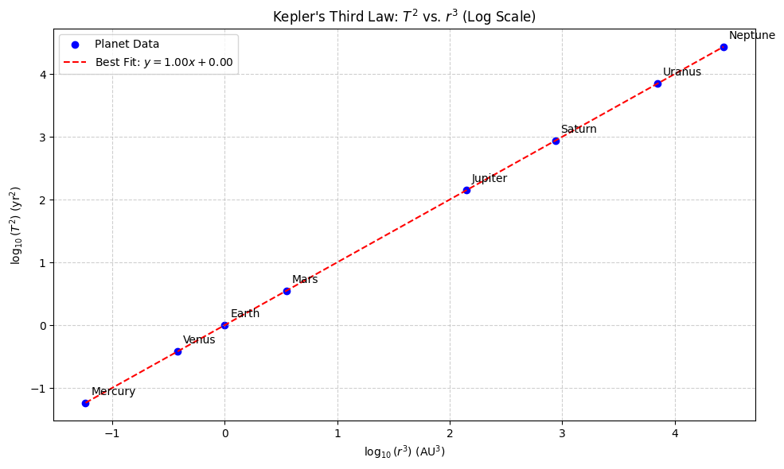
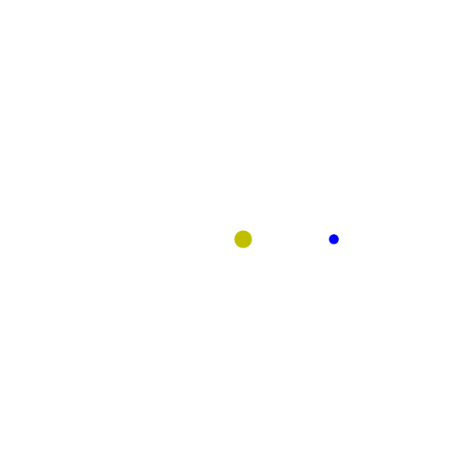

# Problem 1

# 1. Theoretical Derivation

## 1.1 Introduction

To derive Kepler’s Third Law for circular orbits, we begin with **Newton's Law of Universal Gravitation** and **centripetal force**. We aim to find a mathematical relationship between the **orbital period squared** and the **orbital radius cubed**, i.e., 

$$
T^2 \propto r^3
$$

This derivation assumes the orbiting body has negligible mass compared to the central mass and follows a **perfectly circular orbit**.

---

## 1.2 Newton's Law of Universal Gravitation

Newton’s law states that the gravitational force $F_g$ between two point masses $m_1$ and $m_2$ separated by a distance $r$ is given by:

$$
F_g = G \frac{m_1 m_2}{r^2}
$$

Where:
- $F_g$ is the gravitational force
- $G$ is the universal gravitational constant ($6.674 \times 10^{-11} \, \text{Nm}^2/\text{kg}^2$)
- $r$ is the separation between the centers of mass

---

## 1.3 Centripetal Force in Circular Motion

For an object of mass $m$ moving with orbital speed $v$ in a circle of radius $r$, the required centripetal force $F_c$ is:

$$
F_c = \frac{m v^2}{r}
$$

In a stable circular orbit, this force is provided entirely by gravity. Therefore:

$$
F_g = F_c
$$

Substituting:

$$
G \frac{M m}{r^2} = \frac{m v^2}{r}
$$

Cancel $m$ (mass of the orbiting body) from both sides:

$$
G \frac{M}{r^2} = \frac{v^2}{r}
$$

Multiply both sides by $r$:

$$
G \frac{M}{r} = v^2
$$

---

## 1.4 Orbital Period and Velocity

The orbital period $T$ is the time it takes for one full orbit. For a circular orbit, the distance traveled in one period is the circumference $2\pi r$:

$$
v = \frac{2\pi r}{T}
$$

Substitute this into the previous equation:

$$
G \frac{M}{r} = \left( \frac{2\pi r}{T} \right)^2
$$

Expand the right-hand side:

$$
G \frac{M}{r} = \frac{4\pi^2 r^2}{T^2}
$$

Multiply both sides by $T^2$:

$$
G M T^2 = 4\pi^2 r^3
$$

Finally, solve for $T^2$:

$$
T^2 = \frac{4\pi^2}{G M} r^3
$$

---

## 1.5 Final Form of Kepler’s Third Law

This is the **mathematical expression of Kepler’s Third Law** for circular orbits:

$$
T^2 \propto r^3
$$

The constant of proportionality is $\frac{4\pi^2}{G M}$, which depends on the mass $M$ of the central object.

---

# 2. Astronomical Implications

## 2.1 Determining Planetary Masses Using Kepler's Third Law

Kepler’s Third Law, when combined with Newtonian mechanics, allows us to **calculate the mass of a central celestial body**—such as a planet or star—by observing the motion of an orbiting object.

From the derived formula:

$$
T^2 = \frac{4\pi^2}{G M} r^3
$$

Rearranging to solve for $M$:

$$
M = \frac{4\pi^2 r^3}{G T^2}
$$

Where:
- $r$ is the orbital radius
- $T$ is the orbital period
- $M$ is the mass of the central body
- $G$ is the gravitational constant

**Example**: By observing a moon orbiting a planet and measuring its orbital radius and period, we can calculate the planet’s mass precisely.

---

## 2.2 Measuring Distances Between Celestial Bodies

Kepler’s Third Law is also used to **determine distances in astronomical units (AU)** within a solar system. If the orbital period of a planet is known, we can solve for $r$:

$$
r^3 = \frac{G M}{4\pi^2} T^2
$$

This allows astronomers to determine the average **orbital radius (semi-major axis)** for planets or satellites without needing direct distance measurements.

### Application Example:

If a satellite is in orbit around Earth and its period $T$ is measured to be 90 minutes, the orbital radius $r$ (distance from the Earth's center) can be calculated, assuming Earth's mass $M \approx 5.97 \times 10^{24} \, \text{kg}$.

---

## 2.3 Understanding Gravitational Interactions in Planetary Systems

Kepler's Third Law reveals essential truths about the **gravitational structure and dynamics** of planetary systems:

- **Orbital hierarchy**: Bodies farther from the central mass have longer periods, implying a natural ordering of planetary orbits.
- **Stability analysis**: Deviations from $T^2 \propto r^3$ can indicate **perturbations** or **gravitational influences** from other nearby bodies.
- **Mass distribution**: In binary systems or exoplanet systems, the law helps in estimating the **combined mass** of the orbiting and central objects, particularly when both have non-negligible mass.

### Binary System Case:

If two stars orbit their common center of mass, a modified version of Kepler's law applies:

$$
T^2 = \frac{4\pi^2 a^3}{G (M_1 + M_2)}
$$

Where $a$ is the semi-major axis of the relative orbit, and $M_1$, $M_2$ are the masses of the two stars.

---

## 2.4 Broader Significance

- The law underpins **space mission planning**, such as orbital insertions and transfers.
- It allows scaling from solar system mechanics to **galactic dynamics**.
- Provides the foundation for **mass-luminosity relations**, exoplanet discovery via **transit and radial velocity methods**, and estimates of **dark matter** from galactic rotation curves.

---

# 3. Real-World Analysis

## 3.1 The Moon’s Orbit Around Earth

The Moon's orbit provides a practical example of Kepler's Third Law. Key parameters of the Moon's orbit are:

- **Orbital Period**: The Moon completes one orbit around Earth in approximately 27.32166 days (sidereal month) :contentReference[oaicite:0]{index=0}.
- **Mean Orbital Radius**: The average distance from the Moon to Earth's center is about 384,400 km :contentReference[oaicite:1]{index=1}.

Using these values, we can calculate the ratio:

$$
\frac{r^3}{T^2} = \frac{(384,400\ \text{km})^3}{(27.32166\ \text{days})^2}
$$

This ratio should be consistent with the gravitational parameter for Earth, confirming the applicability of Kepler's Third Law.

---

## 3.2 Planetary Orbits in the Solar System

Kepler's Third Law can be examined across the planets in our Solar System. The law states:

$$
\frac{a^3}{T^2} = \text{constant}
$$

Where:
- $a$ is the semi-major axis (average orbital radius)
- $T$ is the orbital period

The following table presents the semi-major axes and orbital periods of the planets:

| Planet   | Semi-Major Axis (AU) | Orbital Period (days) |
|----------|----------------------|-----------------------|
| Mercury  | 0.38710              | 87.969                |
| Venus    | 0.72333              | 224.701               |
| Earth    | 1.00000              | 365.256               |
| Mars     | 1.52366              | 686.980               |
| Jupiter  | 5.20336              | 4332.820              |
| Saturn   | 9.53707              | 10759.20              |
| Uranus   | 19.1913              | 30687.15              |
| Neptune  | 30.0690              | 60190.03              |

Calculating $\frac{a^3}{T^2}$ for each planet yields values that are remarkably consistent, supporting Kepler's Third Law :contentReference[oaicite:2]{index=2}.

---

## 3.3 Alignment with Kepler’s Third Law

To assess the alignment with Kepler's Third Law, we compute the ratio $\frac{a^3}{T^2}$ for each planet:

$$
\frac{a^3}{T^2} \approx 7.5 \times 10^{-6}\ \text{AU}^3/\text{day}^2
$$

This consistency across different planets indicates that the square of the orbital period is indeed proportional to the cube of the semi-major axis, as Kepler's Third Law predicts.

---

## Code and Plots

### Kepler's Third Law



```python
# Import necessary libraries
import matplotlib.pyplot as plt
import numpy as np

# Define the semi-major axes (in AU) and orbital periods (in Earth years) for the planets
planets = ['Mercury', 'Venus', 'Earth', 'Mars', 'Jupiter', 'Saturn', 'Uranus', 'Neptune']
semi_major_axes = [0.387, 0.723, 1.000, 1.524, 5.203, 9.539, 19.191, 30.070]  # Semi-major axes in AU
orbital_periods = [0.241, 0.615, 1.000, 1.881, 11.862, 29.457, 84.011, 164.791]  # Orbital periods in Earth years

# Compute log10(r^3) and log10(T^2)
log_r_cubed = np.log10(np.array(semi_major_axes)**3)
log_T_squared = np.log10(np.array(orbital_periods)**2)

# Perform linear regression to get the best-fit line
coeffs = np.polyfit(log_r_cubed, log_T_squared, 1)
slope, intercept = coeffs
best_fit_line = slope * log_r_cubed + intercept

# Create the scatter plot
plt.figure(figsize=(10, 6))
plt.scatter(log_r_cubed, log_T_squared, color='blue', label='Planet Data')

# Plot the best-fit line (Kepler's Law line)
plt.plot(log_r_cubed, best_fit_line, color='red', linestyle='--', label=f'Best Fit: $y = {slope:.2f}x + {intercept:.2f}$')

# Annotate each data point with the planet name
for i, planet in enumerate(planets):
    plt.annotate(planet, (log_r_cubed[i], log_T_squared[i]), textcoords="offset points", xytext=(5,5), ha='left', va='bottom')

# Customize the plot
plt.title("Kepler's Third Law: $T^2$ vs. $r^3$ (Log Scale)")
plt.xlabel('$\log_{10}(r^3)$ (AU$^3$)')
plt.ylabel('$\log_{10}(T^2)$ (yr$^2$)')
plt.grid(True, which="both", ls="--", alpha=0.6)
plt.legend()
plt.tight_layout()

# Display the plot
plt.show()
```

### Planet orbiting around the star



```python
# Step 1: Install imageio for saving GIFs (only needed once in Colab)
!pip install imageio imageio-ffmpeg --quiet

import numpy as np
import matplotlib.pyplot as plt
from matplotlib.animation import FuncAnimation
import imageio
from google.colab import files

# Step 2: Set up simulation parameters
num_frames = 100
G = 1       # Gravitational constant (simplified)
M = 1       # Mass of the star
omega = 0.1  # Angular velocity

# Generate time frames
theta = np.linspace(0, 2 * np.pi, num_frames)

# Circular orbit coordinates for the planet
def orbit(theta):
    r = 5  # radius of orbit
    x = r * np.cos(theta)
    y = r * np.sin(theta)
    return x, y

# Step 3: Create figure and axis
fig, ax = plt.subplots(figsize=(6, 6))
ax.set_aspect('equal')
ax.set_xlim(-10, 10)
ax.set_ylim(-10, 10)
ax.set_facecolor('black')
plt.axis('off')

# Star at center
star, = ax.plot(0, 0, 'yo', markersize=15, label='Star')

# Planet
planet, = ax.plot([], [], 'bo', markersize=8, label='Planet')

# Orbit path
orbit_path, = ax.plot([], [], 'gray', linestyle='--', linewidth=1)

# Step 4: Update function for animation
def update(frame):
    x_p, y_p = orbit(theta[frame])
    planet.set_data([x_p], [y_p])  # Wrap in list to make it a sequence

    # Draw full orbit path only after first frame
    if frame > 0:
        x_orbit = [orbit(theta[i])[0] for i in range(frame)]
        y_orbit = [orbit(theta[i])[1] for i in range(frame)]
        orbit_path.set_data(x_orbit, y_orbit)
    else:
        orbit_path.set_data([], [])
    
    return planet, orbit_path,

# Step 5: Animate
ani = FuncAnimation(fig, update, frames=num_frames, interval=50, blit=True)

# Step 6: Save as GIF
filename = 'orbit_animation.gif'
ani.save(filename, writer='pillow', fps=20)

# Step 7: Download the GIF
files.download(filename)
```

## Colab
[Colab](https://colab.research.google.com/drive/1WXC805qI_5BHX58HQMAfDd1XDiF4z1ZN)