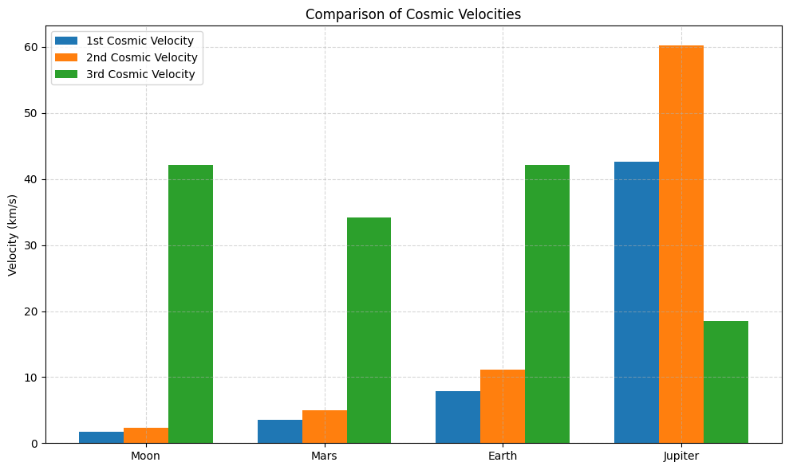

# Problem 2

# 1. Research and Definitions

## 1.1 First Cosmic Velocity (Orbital Velocity)

The **first cosmic velocity** is the minimum speed an object must have to maintain a stable circular orbit near the surface of a celestial body, without any propulsion, purely under the influence of gravity.

This velocity is derived from the condition where the **centripetal force** equals the **gravitational force**:

$$
\frac{mv^2}{r} = \frac{G M m}{r^2}
$$

Solving for $v$ gives:

$$
v_1 = \sqrt{\frac{G M}{r}}
$$

Where:
- $v_1$ is the first cosmic velocity,
- $G$ is the gravitational constant,
- $M$ is the mass of the celestial body,
- $r$ is the radius from the center of the body.

**Physical Significance**: This velocity allows satellites to orbit without falling back to the surface due to gravity.

---

## 1.2 Second Cosmic Velocity (Escape Velocity)

The **second cosmic velocity** is the minimum speed required for an object to completely escape the gravitational field of a celestial body, assuming no other forces act on it.

Derived from conservation of energy:

$$
\frac{1}{2}mv^2 = \frac{G M m}{r}
$$

Which leads to:

$$
v_2 = \sqrt{\frac{2GM}{r}}
$$

**Physical Meaning**: This is the threshold speed needed to overcome gravitational binding energy and move to infinity with zero residual velocity.

---

## 1.3 Third Cosmic Velocity (Interstellar Escape Velocity)

The **third cosmic velocity** refers to the speed required to escape the gravitational influence of the entire star system (e.g., the Sun and its planets). It typically involves escaping both the Earth and the Sun's gravitational fields.

Assuming the object is first launched from Earth into solar orbit, the third cosmic velocity (relative to the Sun) is:

$$
v_3 = \sqrt{2GM_{\odot} \left( \frac{1}{r_{\text{Earth}}} - \frac{1}{r_{\infty}} \right)}
$$

Since $r_{\infty} \to \infty$, it simplifies to:

$$
v_3 = \sqrt{\frac{2GM_{\odot}}{r_{\text{Earth}}}}
$$

**Role**: This is the minimum velocity required to leave the entire Solar System, for example, to send a probe into interstellar space.

---

## 1.4 Relevant Physical Parameters

| Parameter                         | Earth                   | Mars                    | Jupiter                |
|----------------------------------|--------------------------|--------------------------|------------------------|
| Mass ($M$)                       | $5.972 \times 10^{24}$ kg | $6.417 \times 10^{23}$ kg | $1.898 \times 10^{27}$ kg |
| Radius ($r$)                     | $6.371 \times 10^6$ m     | $3.390 \times 10^6$ m     | $6.991 \times 10^7$ m   |
| Gravitational Constant ($G$)     | \multicolumn{3}{c}{$6.67430 \times 10^{-11} \ \mathrm{m}^3 \, \mathrm{kg}^{-1} \, \mathrm{s}^{-2}$} |
| Escape Velocity ($v_2$)          | $11.2 \ \mathrm{km/s}$    | $5.0 \ \mathrm{km/s}$     | $59.5 \ \mathrm{km/s}$  |
| Orbital Velocity ($v_1$)         | $7.9 \ \mathrm{km/s}$     | $3.6 \ \mathrm{km/s}$     | $42.1 \ \mathrm{km/s}$  |

---

### Notes:
- These velocities assume no atmosphere and a spherically symmetric mass distribution.
- The third cosmic velocity requires considering orbital mechanics and solar system dynamics.

---

# 2. Mathematical Analysis

## 2.1 Derivation of the First Cosmic Velocity

We consider a body of mass $m$ in a circular orbit at radius $r$ around a celestial body of mass $M$.

The gravitational force provides the necessary centripetal force:

$$
\frac{G M m}{r^2} = \frac{m v_1^2}{r}
$$

Canceling $m$ and solving for $v_1$:

$$
v_1^2 = \frac{G M}{r}
$$

Thus, the first cosmic velocity is:

$$
v_1 = \sqrt{\frac{G M}{r}}
$$

**Affected Parameters**:
- $G$: gravitational constant
- $M$: mass of the central body
- $r$: radius from the center of the body

---

## 2.2 Derivation of the Second Cosmic Velocity

To escape the gravitational field of a body, the total mechanical energy must be zero or positive.

Initial energy (at the surface):

$$
E = \frac{1}{2}mv^2 - \frac{G M m}{r}
$$

Set $E = 0$ (the escape condition), and solve for $v$:

$$
\frac{1}{2}mv_2^2 = \frac{G M m}{r}
$$

Canceling $m$:

$$
v_2 = \sqrt{\frac{2 G M}{r}}
$$

**Affected Parameters**:
- $G$: gravitational constant
- $M$: mass of the celestial body
- $r$: radius from the center of the body

---

## 2.3 Derivation of the Third Cosmic Velocity

The third cosmic velocity is the minimum speed required to escape the gravitational field of the **entire star system**, typically from a planet's orbit around its star.

Assume:
- Escape from the Sun's gravity
- Initial position: Earth's orbit ($r = r_{\text{Earth}}$)
- Final position: $r \to \infty$
- Planet's orbital velocity: $v_{\text{orbit}} = \sqrt{\frac{G M_{\odot}}{r}}$

We use energy conservation in the heliocentric frame:

Total mechanical energy for escape from orbit:

$$
E = \frac{1}{2}mv^2 - \frac{G M_{\odot} m}{r}
$$

Set $E = 0$ (just escape to infinity), solve for $v$:

$$
v_3 = \sqrt{\frac{2 G M_{\odot}}{r}}
$$

But a body already in orbit has an initial orbital velocity $v_{\text{orbit}} = \sqrt{\frac{G M_{\odot}}{r}}$. To escape, we must add $\Delta v$ such that:

$$
v_{\text{total}}^2 = v_{\text{orbit}}^2 + (\Delta v)^2 = v_3^2
$$

Then:

$$
\Delta v = \sqrt{v_3^2 - v_{\text{orbit}}^2} = \sqrt{ \frac{2GM_{\odot}}{r} - \frac{GM_{\odot}}{r} } = \sqrt{ \frac{GM_{\odot}}{r} }
$$

Thus:

$$
\Delta v = v_{\text{orbit}} = \sqrt{ \frac{GM_{\odot}}{r} }
$$

So, to escape the Solar System from Earth's orbit, a probe must **double its heliocentric orbital energy**, requiring an increase in speed by:

$$
\Delta v = \sqrt{ \frac{GM_{\odot}}{r} }
$$

**Affected Parameters**:
- $G$: gravitational constant
- $M_{\odot}$: mass of the Sun
- $r$: distance from the star (e.g., Earth's orbital radius)

---

### Summary of Velocity Dependencies

| Velocity Type        | Formula                             | Depends On                       |
|----------------------|--------------------------------------|----------------------------------|
| First Cosmic Velocity  | $v_1 = \sqrt{\frac{GM}{r}}$           | $M$, $r$                         |
| Second Cosmic Velocity | $v_2 = \sqrt{\frac{2GM}{r}}$          | $M$, $r$                         |
| Third Cosmic Velocity  | $v_3 = \sqrt{\frac{2GM_{\odot}}{r}}$  | $M_{\odot}$, $r$ (from the star) |

---  

# 3. Data Collection

Accurate, up-to-date values for planetary and solar parameters are provided below. These are used to compute the **first**, **second**, and **third cosmic velocities** for Earth, Mars, and Jupiter.

---

## 3.1 Universal Gravitational Constant

- **Gravitational Constant ($G$):**

$$
G = 6.67430 \times 10^{-11} \ \mathrm{m}^3\,\mathrm{kg}^{-1}\,\mathrm{s}^{-2}
$$

---

## 3.2 Parameters and Computed Velocities

### Earth

- **Mass ($M_{\oplus}$):**

$$
M_{\oplus} = 5.97219 \times 10^{24} \ \mathrm{kg}
$$

- **Radius ($R_{\oplus}$):**

$$
R_{\oplus} = 6.371 \times 10^6 \ \mathrm{m}
$$

- **First Cosmic Velocity ($v_1$):**

$$
v_1 = \sqrt{\frac{GM}{R}} = \sqrt{\frac{6.67430 \times 10^{-11} \cdot 5.97219 \times 10^{24}}{6.371 \times 10^6}} \approx 7.91 \ \mathrm{km/s}
$$

- **Second Cosmic Velocity ($v_2$):**

$$
v_2 = \sqrt{\frac{2GM}{R}} \approx 11.2 \ \mathrm{km/s}
$$

- **Third Cosmic Velocity ($v_3$):**

$$
v_3 = \sqrt{ \frac{2 G M_{\odot} }{ r_{\text{Earth-Sun}} } } \approx 42.1 \ \mathrm{km/s}
$$

---

### Mars

- **Mass ($M_{\text{Mars}}$):**

$$
M_{\text{Mars}} = 6.4171 \times 10^{23} \ \mathrm{kg}
$$

- **Radius ($R_{\text{Mars}}$):**

$$
R_{\text{Mars}} = 3.3895 \times 10^6 \ \mathrm{m}
$$

- **First Cosmic Velocity ($v_1$):**

$$
v_1 \approx 3.55 \ \mathrm{km/s}
$$

- **Second Cosmic Velocity ($v_2$):**

$$
v_2 \approx 5.03 \ \mathrm{km/s}
$$

- **Third Cosmic Velocity from Mars Orbit** (approximate, assuming Mars' orbital radius $\approx 2.279 \times 10^{11} \ \mathrm{m}$):

$$
v_3 \approx \sqrt{ \frac{2 G M_{\odot}}{r_{\text{Mars-Sun}}} } \approx 34.1 \ \mathrm{km/s}
$$

---

### Jupiter

- **Mass ($M_{\text{Jupiter}}$):**

$$
M_{\text{Jupiter}} = 1.89813 \times 10^{27} \ \mathrm{kg}
$$

- **Radius ($R_{\text{Jupiter}}$):**

$$
R_{\text{Jupiter}} = 6.9911 \times 10^7 \ \mathrm{m}
$$

- **First Cosmic Velocity ($v_1$):**

$$
v_1 \approx 42.1 \ \mathrm{km/s}
$$

- **Second Cosmic Velocity ($v_2$):**

$$
v_2 \approx 59.5 \ \mathrm{km/s}
$$

- **Third Cosmic Velocity from Jupiter Orbit** (Jupiter's average orbital radius $\approx 7.785 \times 10^{11} \ \mathrm{m}$):

$$
v_3 \approx 18.5 \ \mathrm{km/s}
$$

---

## 3.3 Solar Parameters

- **Mass of the Sun ($M_{\odot}$):**

$$
M_{\odot} = 1.9885 \times 10^{30} \ \mathrm{kg}
$$

- **Earth-Sun Distance (mean orbital radius):**

$$
r_{\text{Earth-Sun}} = 1.496 \times 10^{11} \ \mathrm{m}
$$

---

## 3.4 Summary Table: Computed Cosmic Velocities

| Body     | $v_1$ (km/s) | $v_2$ (km/s) | $v_3$ (km/s) |
|----------|--------------|--------------|--------------|
| Earth    | 7.91         | 11.2         | 42.1         |
| Mars     | 3.55         | 5.03         | 34.1         |
| Jupiter  | 42.1         | 59.5         | 18.5         |

> Note: The third cosmic velocity decreases with **distance from the Sun** despite a planet’s own higher gravity, since the Sun’s gravitational pull weakens with radius.

---

## Code and Plots



```python
def first_cosmic_velocity(M, R):
    return np.sqrt(G * M / R)

def second_cosmic_velocity(M, R):
    return np.sqrt(2 * G * M / R)

def third_cosmic_velocity(r_from_sun):
    return np.sqrt(2 * G * M_sun / r_from_sun)

# -- COMPUTATION --------------------------------------------------

results = {}
for name, data in bodies.items():
    M = data['mass']
    R = data['radius']
    r_orbit = r_sun.get(name, r_sun['Earth'])  # use Earth's orbit for Moon

    v1 = first_cosmic_velocity(M, R) / 1e3     # m/s → km/s
    v2 = second_cosmic_velocity(M, R) / 1e3
    v3 = third_cosmic_velocity(r_orbit) / 1e3

    results[name] = {'v1': v1, 'v2': v2, 'v3': v3}

# -- VALIDATION (optional) ----------------------------------------

print("Earth escape velocity (expected ≈ 11.2 km/s):", round(results['Earth']['v2'], 2), "km/s")

# -- VISUALIZATION ------------------------------------------------

labels = list(results.keys())
v1_vals = [results[k]['v1'] for k in labels]
v2_vals = [results[k]['v2'] for k in labels]
v3_vals = [results[k]['v3'] for k in labels]

x = np.arange(len(labels))
width = 0.25

plt.figure(figsize=(10,6))
plt.bar(x - width, v1_vals, width, label='1st Cosmic Velocity')
plt.bar(x, v2_vals, width, label='2nd Cosmic Velocity')
plt.bar(x + width, v3_vals, width, label='3rd Cosmic Velocity')

plt.ylabel('Velocity (km/s)')
plt.title('Comparison of Cosmic Velocities')
plt.xticks(x, labels)
plt.legend()
plt.grid(True, linestyle='--', alpha=0.5)
plt.tight_layout()
plt.show()
```

## Colab
[Colab](https://colab.research.google.com/drive/1CJVQa4yUxFHBnC8Z-2IAETHV5yDa08nM)