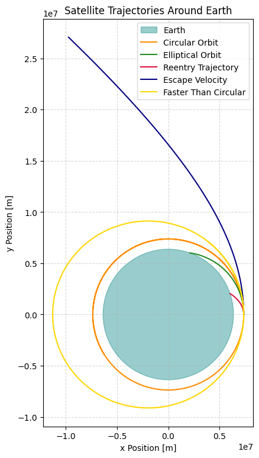
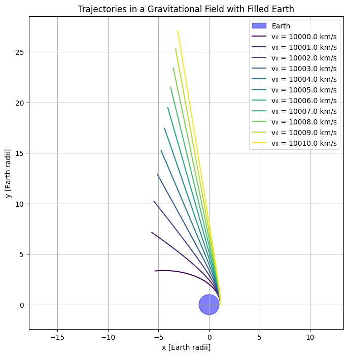
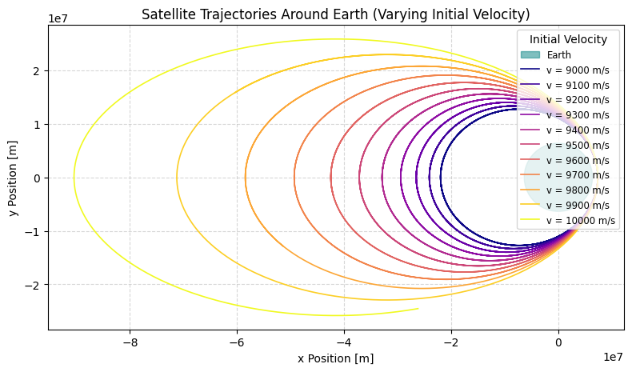

# Problem 3

# Theoretical Analysis

In this section, we derive the equations of motion for orbital mechanics, focusing on Newton’s Law of Gravitation, Kepler’s Laws, and the impact of initial conditions on the trajectory of a spacecraft.

## 1. Deriving Equations of Motion Using Newton’s Law of Gravitation

Newton’s Law of Gravitation gives the force between two masses, which is essential for understanding the motion of objects in space.

The gravitational force \( F \) between two bodies is given by:

$$ F = G \frac{m_1 m_2}{r^2} $$

Where:
- \( F \) is the gravitational force,
- \( G \) is the gravitational constant (\(6.67430 \times 10^{-11} \, \text{m}^3 \, \text{kg}^{-1} \, \text{s}^{-2}\)),
- \( m_1 \) and \( m_2 \) are the masses of the two bodies,
- \( r \) is the distance between their centers.

From Newton’s second law of motion, the force is also equal to mass times acceleration, i.e.,

$$ F = m a $$

Equating the two expressions for \( F \), we get the equation of motion:

$$ m a = G \frac{m_1 m_2}{r^2} $$

For a mass \( m \) orbiting a central body, we can simplify this to:

$$ a = G \frac{m_1}{r^2} $$

This gives us the acceleration experienced by the orbiting body due to gravitational attraction.

## 2. Applying Kepler’s Laws to Classify Trajectories

Kepler's Laws describe the motion of planets and other celestial bodies under the influence of gravity.

### Kepler’s First Law: The Law of Ellipses
The orbit of a planet (or other object) around a central body is an ellipse, with the central body at one focus.

The equation for an ellipse in polar coordinates is:

$$ r(\theta) = \frac{a(1 - e^2)}{1 + e \cos \theta} $$

Where:
- \( r(\theta) \) is the radial distance as a function of the true anomaly \( \theta \),
- \( a \) is the semi-major axis,
- \( e \) is the eccentricity of the ellipse.

### Kepler’s Second Law: The Law of Equal Areas
A line segment joining a planet and the central body sweeps out equal areas during equal intervals of time. This implies that the object moves faster when closer to the central body and slower when farther away.

This can be expressed as:

$$ \frac{dA}{dt} = \frac{1}{2} r^2 \frac{d\theta}{dt} = \text{constant} $$

### Kepler’s Third Law: The Law of Periods
The square of the orbital period \( T \) is proportional to the cube of the semi-major axis \( a \) of the orbit:

$$ T^2 = \frac{4 \pi^2 a^3}{G m_1} $$

Where:
- \( T \) is the orbital period,
- \( a \) is the semi-major axis of the orbit,
- \( m_1 \) is the mass of the central body.

Using Kepler’s Third Law, we can classify possible trajectories into three types:

### 1. Elliptical Trajectory
An object follows a closed elliptical path, typical for most planets, moons, and satellites. The trajectory is bound.

### 2. Parabolic Trajectory
This is the case for an object that escapes a central body with exactly the escape velocity. The trajectory is unbound and follows a parabolic shape.

### 3. Hyperbolic Trajectory
An object that exceeds the escape velocity follows a hyperbolic trajectory, which is also unbound.

## 3. Defining Initial Conditions and Their Impact on Trajectory Types

The trajectory of an object depends on its initial conditions, such as position, velocity, and altitude.

- **Initial Position**: The location in space relative to the central body.
- **Initial Velocity**: The speed and direction at which the object is moving when it is first released or launched.
- **Altitude**: The height above the central body’s surface, which influences the gravitational force and therefore the orbit.

### Impact on Trajectory
- If the initial velocity is less than the escape velocity, the object will follow an elliptical orbit.
- If the initial velocity is equal to the escape velocity, the object will follow a parabolic trajectory.
- If the initial velocity exceeds the escape velocity, the object will follow a hyperbolic trajectory.

The escape velocity \( v_{\text{esc}} \) is given by:

$$ v_{\text{esc}} = \sqrt{\frac{2 G m_1}{r}} $$

Where \( r \) is the initial distance from the center of the central body.

## 4. Analyzing the Relationship Between Trajectories and Orbital Insertion, Reentry, or Escape Scenarios

- **Orbital Insertion**: When a spacecraft enters orbit around a central body, its velocity must be carefully controlled to ensure it follows a stable elliptical orbit. This is typically done by adjusting the spacecraft’s velocity via a maneuver known as a "burn".
  
- **Reentry**: For a spacecraft to reenter a planetary atmosphere, its trajectory must be adjusted so that it intersects the atmosphere at the correct angle and speed. A hyperbolic trajectory may result in a steep, high-speed reentry, which can be dangerous if not controlled.

- **Escape**: An object escapes the gravitational pull of the central body if it reaches or exceeds the escape velocity. This leads to a hyperbolic trajectory, and the object is no longer bound to the central body.

The relationship between velocity and escape or reentry is crucial for mission planning, ensuring the correct orbital path for desired outcomes such as satellite deployment or interplanetary travel.

---

# Numerical Analysis
In this section, we discuss the numerical methods used to solve the differential equations of motion for a payload under the influence of Earth’s gravitational field. The goal is to simulate the payload’s trajectory using a numerical approach and validate the results against known analytical expectations, such as a circular orbit.

## 1. Selecting a Numerical Method
To solve the equations of motion numerically, we will use the **Runge-Kutta method**, specifically the **4th-order Runge-Kutta (RK4)** method. This is a widely used method for solving ordinary differential equations (ODEs) because it offers a good balance between accuracy and computational efficiency.

The general form of the Runge-Kutta method for a first-order differential equation $ \frac{dy}{dt} = f(t, y) $ is:

$$ y_{n+1} = y_n + \frac{h}{6} \left( k_1 + 2k_2 + 2k_3 + k_4 \right) $$

Where:
- $ h $ is the step size,
- $ k_1 = f(t_n, y_n) $,
- $ k_2 = f(t_n + \frac{h}{2}, y_n + \frac{h}{2} k_1) $,
- $ k_3 = f(t_n + \frac{h}{2}, y_n + \frac{h}{2} k_2) $,
- $ k_4 = f(t_n + h, y_n + h k_3) $.

Alternatively, the **Euler method** can be used as a simpler, though less accurate, numerical method:

$$ y_{n+1} = y_n + h f(t_n, y_n) $$

While Euler’s method is easier to implement, it requires smaller step sizes for stability and is less accurate than Runge-Kutta, especially for more complex systems.

## 2. Setting Up Initial Conditions
The initial conditions for the payload’s trajectory must include the position vector, velocity vector, and altitude. We assume the payload is launched from a specific location near Earth’s surface.

Let the initial position vector $ \mathbf{r}_0 $ be:

$$ \mathbf{r}_0 = \begin{bmatrix} r_{x0} \\ r_{y0} \\ r_{z0} \end{bmatrix} $$

Let the initial velocity vector $ \mathbf{v}_0 $ be:

$$ \mathbf{v}_0 = \begin{bmatrix} v_{x0} \\ v_{y0} \\ v_{z0} \end{bmatrix} $$

The altitude $ h_0 $ can be calculated as the distance from the center of Earth:

$$ h_0 = \sqrt{r_{x0}^2 + r_{y0}^2 + r_{z0}^2} - R_E $$

Where $ R_E $ is the radius of Earth.

The equations of motion under the influence of Earth's gravitational field are given by Newton’s second law:

$$ \mathbf{F} = m \mathbf{a} = - \frac{G M_E m}{r^2} \hat{r} $$

Where:
- $ G $ is the gravitational constant,
- $ M_E $ is the mass of Earth,
- $ r $ is the magnitude of the position vector $ \mathbf{r} $,
- $ \hat{r} $ is the unit vector in the direction of $ \mathbf{r} $.

This force is used to update the velocity and position of the payload during each step of the numerical integration.

## 3. Computing the Payload's Path
Using the initial conditions and the numerical method chosen (e.g., Runge-Kutta), we compute the trajectory of the payload over time. The numerical method will integrate the equations of motion iteratively.

The velocity and position at each time step are updated as follows:

$$ \mathbf{r}_{n+1} = \mathbf{r}_n + h \mathbf{v}_n $$

$$ \mathbf{v}_{n+1} = \mathbf{v}_n + h \frac{\mathbf{F}_n}{m} $$

Where:
- $ \mathbf{r}_n $ and $ \mathbf{v}_n $ are the position and velocity at the current time step,
- $ h $ is the step size,
- $ \mathbf{F}_n $ is the gravitational force at the current position.

We continue this process until we reach the desired time, at which point we will have a complete trajectory.

## 4. Validating Numerical Results
After solving for the trajectory using the numerical method, we validate the results against known analytical expectations. For example, in the case of a **circular orbit**, the trajectory should maintain a constant radial distance from the center of Earth.

In a circular orbit, the orbital velocity is constant and is given by:

$$ v_{\text{circular}} = \sqrt{\frac{G M_E}{r}} $$

Where:
- $ r $ is the orbital radius.

We can compare the computed velocity at each point along the trajectory with this theoretical velocity for a circular orbit.

For an **elliptical orbit**, we check if the computed trajectory satisfies Kepler’s Laws, especially the law of equal areas, which implies that the object should sweep out equal areas during equal time intervals.

In the case of more complex orbits or escape trajectories, we verify that the object’s velocity exceeds the escape velocity at the correct point, leading to a trajectory that no longer returns to Earth.

### Example: Circular Orbit Validation
For a payload in a circular orbit at an altitude of 300 km above the Earth's surface, we expect the following conditions:
- The radius from the center of Earth is $ r = R_E + 300 \, \text{km} $,
- The orbital velocity should match the theoretical velocity:

$$ v_{\text{orbital}} = \sqrt{\frac{G M_E}{R_E + 300}} $$

By comparing the computed velocity at each time step with this value, we can verify the accuracy of our numerical solution.
---

## Code and Plots



```python
import numpy as np
import matplotlib.pyplot as plt
from scipy.integrate import solve_ivp

# Constants
G = 6.67430e-11  # Gravitational constant (m^3 kg^-1 s^-2)
M_Earth = 5.972e24  # Mass of Earth (kg)
R_Earth = 6.371e6  # Radius of Earth (m)

# Earth's gravitational potential function
def acceleration(t, y):
    x, y, vx, vy = y
    r = np.sqrt(x**2 + y**2)
    if r < R_Earth:  # Prevent orbits from going through Earth
        return [0, 0, 0, 0]
    a_x = -G * M_Earth * x / r**3
    a_y = -G * M_Earth * y / r**3
    return [vx, vy, a_x, a_y]

# Solve the equations of motion using solve_ivp
def simulate_orbit(y0, t_span, dt):
    sol = solve_ivp(acceleration, t_span, y0, dense_output=True, rtol=1e-9, atol=1e-12)
    t = np.arange(t_span[0], t_span[1], dt)
    y = sol.sol(t)
    
    # Filter out points inside the Earth
    x, y_vals = y[0, :], y[1, :]
    r = np.sqrt(x**2 + y_vals**2)
    mask = r >= R_Earth
    x, y_vals = x[mask], y_vals[mask]
    
    return t[mask], np.array([x, y_vals])

# Plotting function
def plot_orbits(trajectories, earth_radius=R_Earth):
    fig, ax = plt.subplots(figsize=(8, 8))
    ax.set_aspect('equal')
    
    # Draw Earth
    circle = plt.Circle((0, 0), earth_radius, color='teal', alpha=0.4, label="Earth")
    ax.add_artist(circle)
    
    # Plot trajectories
    colors = ['darkorange', 'forestgreen', 'crimson', 'navy', 'gold']
    labels = [
        "Circular Orbit",
        "Elliptical Orbit",
        "Reentry Trajectory",
        "Escape Velocity",
        "Faster Than Circular"
    ]
    
    for i, traj in enumerate(trajectories):
        if traj[1] is not None:
            x, y = traj[1][0, :], traj[1][1, :]
            ax.plot(x, y, label=labels[i], color=colors[i], linewidth=1.5)
    
    # Add labels and legend
    ax.set_xlabel("x Position [m]")
    ax.set_ylabel("y Position [m]")
    ax.legend(loc='upper right')
    ax.grid(True, linestyle='--', alpha=0.5)
    plt.title("Satellite Trajectories Around Earth")
    plt.tight_layout()
    plt.show()

# Define initial conditions for multiple trajectories
trajectories = []

# Circular orbit
y0_circular = [R_Earth + 1e6, 0, 0, np.sqrt(G * M_Earth / (R_Earth + 1e6))]
trajectories.append(simulate_orbit(y0_circular, [0, 10000], 1))

# Elliptical orbit (slightly perturbed from circular)
y0_elliptical = [R_Earth + 1e6, 0, 0, np.sqrt(G * M_Earth / (R_Earth + 1e6)) * 0.9]
trajectories.append(simulate_orbit(y0_elliptical, [0, 12000], 1))

# Reentry trajectory (low velocity)
y0_reentry = [R_Earth + 1e6, 0, 0, np.sqrt(G * M_Earth / (R_Earth + 1e6)) * 0.5]
trajectories.append(simulate_orbit(y0_reentry, [0, 8000], 1))

# Escape trajectory (high velocity)
y0_escape = [R_Earth + 1e6, 0, 0, np.sqrt(G * M_Earth / (R_Earth + 1e6)) * 1.5]
trajectories.append(simulate_orbit(y0_escape, [0, 4000], 1))

# Faster than circular orbit
y0_faster_circular = [R_Earth + 1e6, 0, 0, np.sqrt(G * M_Earth / (R_Earth + 1e6)) * 1.1]
trajectories.append(simulate_orbit(y0_faster_circular, [0, 10000], 1))

# Plot all trajectories
plot_orbits(trajectories)
```
---



```python
import numpy as np
import matplotlib.pyplot as plt
from scipy.integrate import solve_ivp

# Constants
G = 6.67430e-11  # Gravitational constant (m^3 kg^-1 s^-2)
M_Earth = 5.972e24  # Mass of Earth (kg)
R_Earth = 6.371e6  # Radius of Earth (m)
Earth_radius_plot = 1.0  # Earth radius in plot units (normalized)

# Initial conditions
initial_height = 800e3  # 800 km above Earth's surface (m)
initial_position = np.array([R_Earth + initial_height, 0])  # Starting position (x, y)
initial_velocity_min = 10e3  # Minimum initial velocity (m/s)
initial_velocity_max = 20e3  # Maximum initial velocity (m/s)
velocity_step = 1e3  # Step size for velocity (m/s)

# Time span for simulation
t_span = (0, 10000)  # Simulation time in seconds

# Function to compute acceleration due to gravity
def acceleration(t, state):
    x, y, vx, vy = state
    r = np.sqrt(x**2 + y**2)  # Distance from Earth's center
    F = -G * M_Earth / r**3  # Gravitational force per unit mass
    ax = F * x
    ay = F * y
    return [vx, vy, ax, ay]

# Solve ODE for each initial velocity
trajectories = []
for v0 in np.arange(initial_velocity_min, initial_velocity_max + velocity_step, velocity_step):
    # Initial state: [x, y, vx, vy]
    initial_state = [*initial_position, 0, v0]  # Zero horizontal velocity
    solution = solve_ivp(acceleration, t_span, initial_state, atol=1e-9, rtol=1e-9)
    trajectories.append(solution.y[:2])  # Store only x and y positions

# Plot the results
plt.figure(figsize=(8, 8))
plt.title("Trajectories in a Gravitational Field with Filled Earth")
plt.xlabel("x [Earth radii]")
plt.ylabel("y [Earth radii]")

# Plot Earth
circle = plt.Circle((0, 0), Earth_radius_plot, color='blue', alpha=0.5, label="Earth")
plt.gca().add_patch(circle)

# Plot trajectories
colors = plt.cm.viridis(np.linspace(0, 1, len(trajectories)))
for i, traj in enumerate(trajectories):
    x, y = traj
    plt.plot(x / R_Earth, y / R_Earth, color=colors[i], label=f"v₀ = {initial_velocity_min + i * velocity_step / 1e3:.1f} km/s")

plt.legend()
plt.axis('equal')
plt.grid(True)
plt.show()
```

---



```python
import numpy as np
import matplotlib.pyplot as plt
from scipy.integrate import solve_ivp

# Constants
G = 6.67430e-11  # Gravitational constant (m^3 kg^-1 s^-2)
M_Earth = 5.972e24  # Mass of Earth (kg)
R_Earth = 6.371e6  # Radius of Earth (m)

# Acceleration due to Earth's gravity
def acceleration(t, y):
    x, y, vx, vy = y
    r = np.hypot(x, y)  # Faster than sqrt(x**2 + y**2)
    if r < R_Earth:  # Prevent going inside Earth
        return [0, 0, 0, 0]
    a = -G * M_Earth / r**3
    return [vx, vy, a * x, a * y]

# Simulate orbit given initial conditions
def simulate_orbit(y0, t_span, dt):
    sol = solve_ivp(acceleration, t_span, y0, dense_output=True, rtol=1e-9, atol=1e-12)
    t = np.arange(*t_span, dt)
    x, y = sol.sol(t)[0], sol.sol(t)[1]
    r = np.hypot(x, y)
    mask = r >= R_Earth
    return x[mask], y[mask]

# Plot multiple trajectories
def plot_trajectories(initial_conditions_list, t_max=100000, num_points=20000):
    fig, ax = plt.subplots(figsize=(8, 8))
    ax.set_aspect('equal')
    
    # Draw Earth
    earth_circle = plt.Circle((0, 0), R_Earth, color='teal', alpha=0.5, label="Earth")
    ax.add_artist(earth_circle)
    
    colors = plt.cm.plasma(np.linspace(0, 1, len(initial_conditions_list)))
    
    dt = t_max / num_points
    for i, (x0, y0, vx0, vy0) in enumerate(initial_conditions_list):
        x_traj, y_traj = simulate_orbit([x0, y0, vx0, vy0], [0, t_max], dt)
        ax.plot(x_traj, y_traj, color=colors[i], linewidth=1.2, label=f"v = {vy0:.0f} m/s")

    # Axis settings
    ax.set_xlabel("x Position [m]")
    ax.set_ylabel("y Position [m]")
    ax.legend(loc='upper right', title="Initial Velocity", fontsize='small')
    ax.grid(True, linestyle='--', alpha=0.5)
    plt.title("Satellite Trajectories Around Earth (Varying Initial Velocity)")
    plt.tight_layout()
    plt.show()

# Define initial conditions
initial_conditions_list = [
    (R_Earth + 1e6, 0, 0, 9000),
    (R_Earth + 1e6, 0, 0, 9100),
    (R_Earth + 1e6, 0, 0, 9200),
    (R_Earth + 1e6, 0, 0, 9300),
    (R_Earth + 1e6, 0, 0, 9400),
    (R_Earth + 1e6, 0, 0, 9500),
    (R_Earth + 1e6, 0, 0, 9600),
    (R_Earth + 1e6, 0, 0, 9700),
    (R_Earth + 1e6, 0, 0, 9800),
    (R_Earth + 1e6, 0, 0, 9900),
    (R_Earth + 1e6, 0, 0, 10000),
]

# Run simulation and plot
plot_trajectories(initial_conditions_list, t_max=100000, num_points=20000)
```

## Colab
[Colab](https://colab.research.google.com/drive/1wx9GhiBFtkUn58U_VoO2hIqG4AyF5Of4)