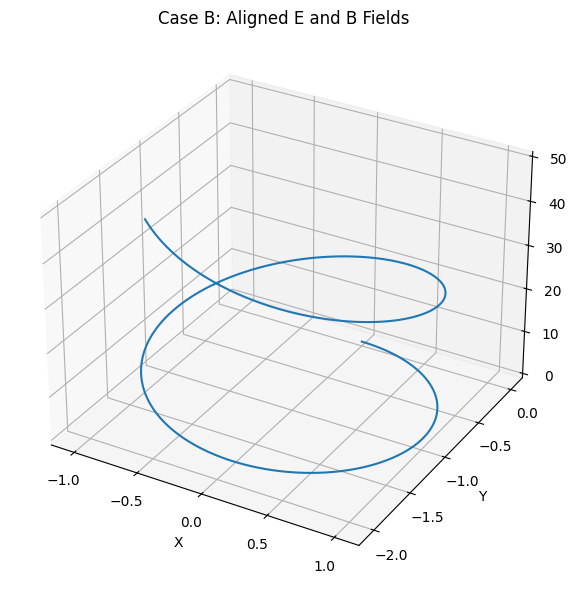

# Problem 1

# Sector 1: Conceptual and Contextual Groundwork

The Lorentz force is a fundamental principle in classical electrodynamics that governs the motion of charged particles under the influence of electric and magnetic fields. It is expressed as:

$$
\mathbf{F} = q\mathbf{E} + q\mathbf{v} \times \mathbf{B}
$$

where:
- $q$ is the electric charge of the particle,
- $\mathbf{E}$ is the electric field vector,
- $\mathbf{B}$ is the magnetic field vector,
- $\mathbf{v}$ is the velocity vector of the particle.

This force law is central to the operation of several modern technologies and natural phenomena.

---

## Real-World Systems Influenced by the Lorentz Force

### 1. Particle Accelerators

In particle accelerators such as cyclotrons and synchrotrons, electric fields are used to **accelerate** particles, while magnetic fields **guide** their paths.

- The **electric field** provides work on the particle:
  $$
  W = q\mathbf{E} \cdot \mathbf{d}
  $$
  which increases the kinetic energy:
  $$
  \Delta K = qE\Delta x \quad \text{(for uniform } \mathbf{E} \text{ along } x)
  $$

- The **magnetic field** bends the particle’s trajectory due to the $\mathbf{v} \times \mathbf{B}$ term:
  $$
  \mathbf{F}_\text{mag} = q\mathbf{v} \times \mathbf{B}
  $$

- If $\mathbf{v} \perp \mathbf{B}$, the particle follows a circular path with **radius of curvature**:
  $$
  r = \frac{mv}{|q|B}
  $$

- The **cyclotron frequency**, or Larmor frequency, is given by:
  $$
  \omega_c = \frac{|q|B}{m}
  $$

### 2. Mass Spectrometers

Mass spectrometers exploit the Lorentz force to **separate ions based on mass-to-charge ratio** $(m/q)$.

- After acceleration by an electric field to a velocity $v$, the ion enters a magnetic field:
  $$
  qE = \frac{1}{2}mv^2 \Rightarrow v = \sqrt{\frac{2qV}{m}}
  $$

- The radius of curvature in the magnetic field allows mass determination:
  $$
  r = \frac{mv}{qB}
  \quad \Rightarrow \quad
  \frac{m}{q} = \frac{rB}{v}
  $$

### 3. Plasma Confinement Devices

Devices such as **tokamaks** and **stellarators** use magnetic fields to confine high-temperature plasmas.

- Charged particles spiral around magnetic field lines:
  $$
  \text{Helical motion: } \mathbf{v} = v_\parallel \hat{b} + v_\perp
  $$

- The **magnetic mirror effect** occurs when field strength varies along the path:
  $$
  \mu = \frac{mv_\perp^2}{2B} \quad \text{(magnetic moment conserved)}
  $$

### 4. Astrophysical Environments

Charged particles in space, such as cosmic rays and solar wind ions, are deflected and guided by galactic and planetary magnetic fields.

- The **Earth’s magnetosphere** traps particles in radiation belts, e.g., Van Allen belts.

- **Drift motion** arises due to inhomogeneities in $\mathbf{B}$:

$$
\mathbf{v}_\text{drift} = \frac{1}{qB^2} (\mathbf{F}_\text{ext} \times \mathbf{B})
$$
---

## Physical Roles of Electric and Magnetic Fields

### Electric Fields: Acceleration and Steering

An electric field performs work on a charged particle:

$$
\mathbf{F}_\text{elec} = q\mathbf{E}
$$

This force causes **linear acceleration** in the direction of the field for positive charges, and opposite for negative ones.

- Work-energy relation:
  $$
  W = \Delta K = qEd
  $$

- In time-dependent fields, particles can be oscillated or focused using **RF cavities**.

### Magnetic Fields: Guidance and Curvature

Magnetic fields do **no work** on charged particles since:

$$
\mathbf{F}_\text{mag} \cdot \mathbf{v} = q (\mathbf{v} \times \mathbf{B}) \cdot \mathbf{v} = 0
$$

Instead, they alter the **direction** of motion, producing:

- **Circular** or **helical** orbits depending on velocity component parallel to $\mathbf{B}$.
- **Gyromotion** with characteristic radius and frequency:
  $$
  r_L = \frac{mv_\perp}{|q|B}, \quad \omega_L = \frac{|q|B}{m}
  $$

- **Magnetic confinement** by forcing charged particles to remain near field lines.

---

These foundational concepts are critical before undertaking numerical simulations of the Lorentz force, as they inform expected behaviors and aid in validating results.

# Sector 2: Mathematical and Physical Modeling

In order to simulate the motion of charged particles under electromagnetic influence, we must begin by rigorously formulating the equation of motion derived from classical electrodynamics.

---

## Equation of Motion

The total force $\mathbf{F}$ acting on a charged particle in the presence of electric and magnetic fields is given by the **Lorentz force law**:

$$
\mathbf{F} = q\mathbf{E} + q\mathbf{v} \times \mathbf{B}
$$

According to Newton's second law, this force is also equal to the time derivative of momentum:

$$
\mathbf{F} = m\frac{d\mathbf{v}}{dt}
$$

Combining these, we obtain the fundamental equation of motion:

$$
m\frac{d\mathbf{v}}{dt} = q\mathbf{E} + q\mathbf{v} \times \mathbf{B}
$$

For numerical integration, this can be rewritten as a first-order system:

$$
\frac{d\mathbf{r}}{dt} = \mathbf{v}, \quad
\frac{d\mathbf{v}}{dt} = \frac{q}{m}(\mathbf{E} + \mathbf{v} \times \mathbf{B})
$$

---

## Numerical Methods for Integration

As these differential equations are generally nonlinear and lack closed-form solutions for arbitrary field configurations, we must resort to **numerical integration techniques**. Two widely used methods are:

### 1. Euler Method

The Euler method provides a first-order approximation:

- Velocity update:
  $$
  \mathbf{v}_{n+1} = \mathbf{v}_n + \Delta t \cdot \frac{q}{m}(\mathbf{E}_n + \mathbf{v}_n \times \mathbf{B}_n)
  $$

- Position update:
  $$
  \mathbf{r}_{n+1} = \mathbf{r}_n + \Delta t \cdot \mathbf{v}_n
  $$

While simple and fast, it is only conditionally stable and prone to significant numerical error in the presence of strong magnetic fields.

### 2. Runge-Kutta Method (4th Order)

A more accurate approach is the classical fourth-order Runge-Kutta (RK4) method. For a general system $\dot{\mathbf{y}} = \mathbf{f}(t, \mathbf{y})$, it proceeds as:

$$
\begin{aligned}
\mathbf{k}_1 &= \mathbf{f}(t_n, \mathbf{y}_n) \\
\mathbf{k}_2 &= \mathbf{f}\left(t_n + \frac{\Delta t}{2}, \mathbf{y}_n + \frac{\Delta t}{2}\mathbf{k}_1\right) \\
\mathbf{k}_3 &= \mathbf{f}\left(t_n + \frac{\Delta t}{2}, \mathbf{y}_n + \frac{\Delta t}{2}\mathbf{k}_2\right) \\
\mathbf{k}_4 &= \mathbf{f}(t_n + \Delta t, \mathbf{y}_n + \Delta t\mathbf{k}_3) \\
\mathbf{y}_{n+1} &= \mathbf{y}_n + \frac{\Delta t}{6}(\mathbf{k}_1 + 2\mathbf{k}_2 + 2\mathbf{k}_3 + \mathbf{k}_4)
\end{aligned}
$$

Applied to our velocity and position system, RK4 ensures **higher stability and accuracy**, especially when dealing with helical or oscillatory motion induced by $\mathbf{B}$ fields.

---

## Simulation Parameters

To fully specify the problem, the following physical parameters must be defined prior to integration:

### 1. Charge ($q$)

Determines the sign and magnitude of the Lorentz force. Common values include:
- Electron: $q = -1.6 \times 10^{-19}$ C  
- Proton: $q = +1.6 \times 10^{-19}$ C  

### 2. Mass ($m$)

Inertia of the particle. Influences acceleration under applied force:
- Electron: $m = 9.11 \times 10^{-31}$ kg  
- Proton: $m = 1.67 \times 10^{-27}$ kg  

### 3. Initial Velocity ($\mathbf{v}_0$)

Vector defining the particle's initial state of motion. Components relative to the field directions ($v_\parallel$, $v_\perp$) determine motion type:
- Circular ($\mathbf{v} \perp \mathbf{B}$)  
- Helical (general 3D case)

### 4. Electric Field ($\mathbf{E}$)

Applied field that contributes to linear acceleration:
$$
\mathbf{F}_\text{electric} = q\mathbf{E}
$$

Can be uniform, non-uniform, static, or time-varying.

### 5. Magnetic Field ($\mathbf{B}$)

Field responsible for transverse force:
$$
\mathbf{F}_\text{magnetic} = q\mathbf{v} \times \mathbf{B}
$$

Primarily affects trajectory curvature and confinement.

---

Together, these equations and parameters form the **foundation for simulating** the motion of charged particles under electromagnetic fields, enabling us to build increasingly realistic and physically accurate models.

# Electromagnetism: Lorentz Force Simulation

We simulate the motion of a charged particle subject to electric and magnetic fields using the Lorentz Force law.

## Lorentz Force Law

$$
\mathbf{F} = q\mathbf{E} + q\mathbf{v} \times \mathbf{B}
$$

Using Newton's second law:

$$
m \frac{d\mathbf{v}}{dt} = q (\mathbf{E} + \mathbf{v} \times \mathbf{B})
$$

We also track:

$$
\frac{d\mathbf{r}}{dt} = \mathbf{v}
$$

We'll numerically integrate this system using the Euler method.

### Parameters

- $q = 1 \, \text{C}$
- $m = 0.001 \, \text{kg}$
- Time step $\Delta t = 0.001 \, \text{s}$
- Number of steps: $N = 10000$

## Code and Plots


---

---


```python

import numpy as np
import matplotlib.pyplot as plt
from mpl_toolkits.mplot3d import Axes3D

# === Sector 1: Common Functions ===

def lorentz_force(q, m, E, B, v):
    """Compute the Lorentz force per unit mass."""
    return (q / m) * (E + np.cross(v, B))

def simulate_motion(q, m, E, B, v_init, r_init, dt, num_steps):
    """Simulate particle trajectory under Lorentz force using Euler method."""
    v = np.array(v_init, dtype=float)
    r = np.array(r_init, dtype=float)
    trajectory = [r.copy()]
    
    for _ in range(num_steps):
        a = lorentz_force(q, m, E, B, v)
        v += a * dt
        r += v * dt
        trajectory.append(r.copy())
    
    return np.array(trajectory)

def plot_trajectory(trajectory, title='3D Trajectory'):
    """Plot 3D trajectory of the particle."""
    fig = plt.figure(figsize=(8, 6))
    ax = fig.add_subplot(111, projection='3d')
    ax.plot(trajectory[:, 0], trajectory[:, 1], trajectory[:, 2])
    ax.set_xlabel('X')
    ax.set_ylabel('Y')
    ax.set_zlabel('Z')
    ax.set_title(title)
    ax.grid(True)
    plt.tight_layout()
    plt.show()


# === Sector 2: Simulation Parameters ===
q, m = 1.0, 1.0     # Charge and mass
dt = 0.01           # Time step
steps = 1000        # Number of integration steps


# === Sector 3: Case A - Helical Motion ===
print("Running Case A: Helical Motion (Uniform Magnetic Field Only)")

B_A = np.array([0, 0, 1])
E_A = np.zeros(3)
v0_A = [1, 0, 1]
r0_A = [0, 0, 0]

trajectory_A = simulate_motion(q, m, E_A, B_A, v0_A, r0_A, dt, steps)
plot_trajectory(trajectory_A, title='Case A: Helical Motion in Uniform B Field')


# === Sector 4: Case B - Aligned E and B ===
print("Running Case B: Aligned Electric and Magnetic Fields")

B_B = np.array([0, 0, 1])
E_B = np.array([0, 0, 1])
v0_B = [1, 0, 0]
r0_B = [0, 0, 0]

trajectory_B = simulate_motion(q, m, E_B, B_B, v0_B, r0_B, dt, steps)
plot_trajectory(trajectory_B, title='Case B: Aligned E and B Fields')


# === Sector 5: Case C - Crossed E × B Fields ===
print("Running Case C: Crossed Electric and Magnetic Fields (E × B Drift)")

B_C = np.array([0, 0, 1])
E_C = np.array([1, 0, 0])
v0_C = [0, 0, 0]
r0_C = [0, 0, 0]

trajectory_C = simulate_motion(q, m, E_C, B_C, v0_C, r0_C, dt, steps)
plot_trajectory(trajectory_C, title='Case C: Crossed E and B Fields (E × B Drift)')
```

[Colab](https://colab.research.google.com/drive/1I7k1RVdSVBdTG8CCLN-LS481sLJE_pNQ)