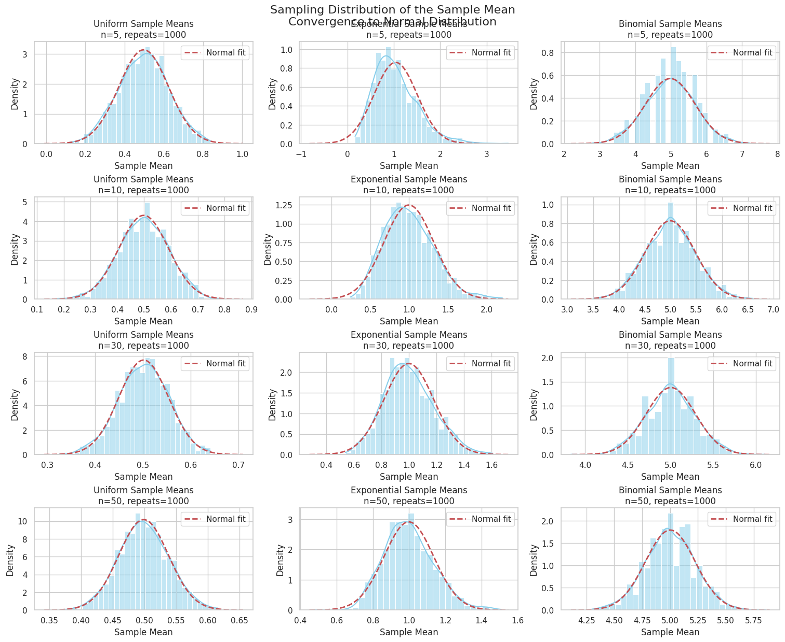

# Problem 1

# Data Generation in Statistical Analysis

Data generation is a foundational step in statistical modeling and simulation. Selecting appropriate population distribution types and generating large datasets representative of those populations is crucial for valid inference.

## Population Distributions

Consider three common types of population distributions:

### 1. Uniform Distribution

A continuous uniform distribution on the interval $[a, b]$ has the probability density function (PDF):

$$
f_X(x) = \frac{1}{b - a}, \quad a \leq x \leq b
$$

The cumulative distribution function (CDF) is:

$$
F_X(x) = \frac{x - a}{b - a}, \quad a \leq x \leq b
$$

To generate a dataset $\{X_i\}_{i=1}^n$ from a uniform distribution, sample $n$ independent observations where

$$
X_i \sim \text{Uniform}(a, b), \quad i = 1, 2, \ldots, n
$$

---

### 2. Exponential Distribution

The exponential distribution is often used to model waiting times and has PDF:

$$
f_X(x) = \lambda e^{-\lambda x}, \quad x \geq 0, \lambda > 0
$$

where $\lambda$ is the rate parameter. The CDF is:

$$
F_X(x) = 1 - e^{-\lambda x}, \quad x \geq 0
$$

Generate $n$ samples from

$$
X_i \sim \text{Exponential}(\lambda), \quad i = 1, 2, \ldots, n
$$

---

### 3. Binomial Distribution

The binomial distribution models the number of successes in $n$ independent Bernoulli trials, each with success probability $p$.

The probability mass function (PMF) is:

$$
P(X = k) = \binom{n}{k} p^k (1-p)^{n-k}, \quad k = 0, 1, \ldots, n
$$

To generate data,

$$
X_i \sim \text{Binomial}(n, p), \quad i = 1, 2, \ldots, m
$$

where $m$ is the number of generated observations.

---

## Generating Large Datasets

Given a selected population distribution, generate a large dataset to approximate the population:

1. Fix distribution parameters (e.g., $a,b$ for uniform, $\lambda$ for exponential, $n,p$ for binomial).
2. Select a sample size $N$ sufficiently large to represent the population well.
3. Use random number generation methods to simulate:

$$
\{X_i\}_{i=1}^N \sim \text{Distribution}(\text{parameters})
$$

This process provides a simulated population for analysis.

---

## Summary

| Distribution   | Parameters       | Support       | PDF / PMF                                |
|----------------|------------------|---------------|-----------------------------------------|
| Uniform        | $a, b$           | $[a,b]$       | $f_X(x) = \frac{1}{b - a}$              |
| Exponential    | $\lambda > 0$    | $[0, \infty)$ | $f_X(x) = \lambda e^{-\lambda x}$       |
| Binomial       | $n \in \mathbb{N}$, $p \in [0,1]$ | $\{0,\ldots,n\}$ | $P(X=k) = \binom{n}{k} p^k (1-p)^{n-k}$ |

---

## Example: Generating Data

Suppose we want to generate $N=10,000$ samples from a uniform distribution on $[0,1]$:

$$
X_i \sim \text{Uniform}(0,1), \quad i=1,\ldots, 10000
$$

Similarly, for exponential with $\lambda=2$:

$$
X_i \sim \text{Exponential}(2), \quad i=1,\ldots, 10000
$$

And binomial with $n=10$, $p=0.5$:

$$
X_i \sim \text{Binomial}(10, 0.5), \quad i=1,\ldots, 10000
$$

---

This framework allows for robust simulation of population data across multiple distribution types, fundamental for subsequent statistical analysis and inference.

---
# Sampling Process and Sampling Distribution of the Sample Mean

Sampling from a population distribution is the core of inferential statistics. This process involves drawing samples of various sizes, calculating sample statistics, and understanding their behavior through repeated sampling.

---

## 1. Sampling from Population Distributions

Given a population distribution with random variable $X$, we draw samples of size $n$:

$$
\{X_1, X_2, \ldots, X_n\} \quad \text{i.i.d.} \sim F_X
$$

where $F_X$ denotes the population distribution (e.g., Uniform, Exponential, Binomial).

Typical sample sizes considered are:

$$
n \in \{5, 10, 30, 50\}
$$

---

## 2. Sample Mean

For each sample of size $n$, the sample mean $\bar{X}_n$ is calculated as:

$$
\bar{X}_n = \frac{1}{n} \sum_{i=1}^n X_i
$$

The sample mean $\bar{X}_n$ is a random variable itself because it depends on the randomly drawn sample.

---

## 3. Repeated Sampling and Sampling Distribution

To understand the variability and distribution of the sample mean, repeat the sampling process $M$ times:

$$
\bar{X}_n^{(1)}, \bar{X}_n^{(2)}, \ldots, \bar{X}_n^{(M)}
$$

where each $\bar{X}_n^{(j)}$ is the mean of the $j$th sample of size $n$.

This collection forms the **sampling distribution of the sample mean** for sample size $n$.

---

## 4. Properties of the Sampling Distribution

By the **Law of Large Numbers** and **Central Limit Theorem (CLT)**, for sufficiently large $n$:

- The expected value of the sample mean equals the population mean $\mu$:

$$
\mathbb{E}[\bar{X}_n] = \mu
$$

- The variance of the sample mean is:

$$
\mathrm{Var}(\bar{X}_n) = \frac{\sigma^2}{n}
$$

where $\sigma^2$ is the variance of the population.

- As $n \to \infty$, the distribution of $\bar{X}_n$ approaches a normal distribution:

$$
\bar{X}_n \xrightarrow{d} \mathcal{N}\left(\mu, \frac{\sigma^2}{n}\right)
$$

---

## 5. Practical Steps in the Sampling Process

1. **Randomly sample** $n$ observations from the population $X$.
2. **Calculate the sample mean** $\bar{X}_n$.
3. **Repeat** steps 1 and 2, $M$ times (e.g., $M = 1000$).
4. **Construct** the sampling distribution of $\bar{X}_n$ by collecting all sample means.

This process allows us to empirically estimate the shape, mean, and variance of the sampling distribution.

---

## 6. Summary of Notation

| Symbol          | Meaning                                 |
|-----------------|-----------------------------------------|
| $X_i$           | $i$th observation from the population  |
| $n$             | Sample size                            |
| $\bar{X}_n$     | Sample mean for sample size $n$        |
| $M$             | Number of repeated samples (resamples) |
| $\mu$           | Population mean                        |
| $\sigma^2$      | Population variance                    |

---

## Example: Sampling from a Uniform Population

Assume

$$
X \sim \text{Uniform}(0,1)
$$

For $n=5$:

- Draw $M=1000$ samples $\{X_1^{(j)}, \ldots, X_5^{(j)}\}$, $j=1,\ldots,1000$.
- Compute

$$
\bar{X}_5^{(j)} = \frac{1}{5} \sum_{i=1}^5 X_i^{(j)}
$$

- The empirical distribution of $\{\bar{X}_5^{(j)}\}_{j=1}^{1000}$ approximates the sampling distribution of $\bar{X}_5$.

Repeat the procedure for other sample sizes $n = 10, 30, 50$ to observe the effect of increasing sample size on the sampling distribution.

---

This framework sets the foundation for understanding estimator behavior and forms the basis of hypothesis testing and confidence interval construction in statistics.
---

# Practical Reflection on the Central Limit Theorem (CLT)

The Central Limit Theorem (CLT) is a cornerstone of statistical inference, underpinning many real-world applications across diverse fields by justifying the approximation of sampling distributions as normal, regardless of the population distribution.

---

## 1. Real-World Applications of the CLT

### (a) Estimating Population Parameters

The CLT allows practitioners to use sample means $\bar{X}_n$ to estimate population means $\mu$ with quantifiable uncertainty. Given a sufficiently large sample size $n$, the sampling distribution of $\bar{X}_n$ is approximately normal:

$$
\bar{X}_n \sim \mathcal{N}\left(\mu, \frac{\sigma^2}{n}\right)
$$

This enables construction of confidence intervals and hypothesis tests for $\mu$, even when the population distribution is unknown or non-normal.

---

### (b) Quality Control in Manufacturing

In manufacturing processes, quality metrics (e.g., dimensions, weights) are monitored via sample means from production batches. The CLT justifies the use of control charts based on $\bar{X}_n$ to detect shifts in the process mean.

The normality assumption allows setting control limits at:

$$
\mu \pm z_{\alpha/2} \frac{\sigma}{\sqrt{n}}
$$

where $z_{\alpha/2}$ is the critical value from the standard normal distribution. This helps identify defective batches and maintain product standards.

---

### (c) Predicting Outcomes in Financial Models

Financial analysts rely on the CLT to model aggregate returns or portfolio averages. Even if individual asset returns are not normal, the average return of a large portfolio tends toward normality:

$$
\bar{R}_n = \frac{1}{n} \sum_{i=1}^n R_i \approx \mathcal{N}\left(\mu_R, \frac{\sigma_R^2}{n}\right)
$$

This underpins risk management, option pricing, and value-at-risk calculations.

---

## 2. How Simulation Supports These Applications

Through simulation, the theoretical properties of the CLT can be observed empirically:

- By generating repeated samples from various populations (e.g., skewed, discrete), and calculating sample means $\bar{X}_n$, one observes that the distribution of $\bar{X}_n$ increasingly resembles a normal distribution as $n$ grows.
  
- Simulations validate that variance of the sample mean decreases as $1/n$, confirming improved estimator precision.

- They demonstrate robustness of CLT applications, even when underlying assumptions are mildly violated.

---

## 3. Summary

The CLT provides a powerful theoretical foundation enabling:

- **Reliable parameter estimation** from sample statistics.
- **Quality assurance** through monitoring sample means.
- **Financial risk modeling** using aggregate return distributions.

Simulations act as practical tools to visualize and verify the CLT's guarantees, strengthening confidence in applying these statistical techniques to complex, real-world problems.

---


## Code and Plots



```python
import numpy as np
import matplotlib.pyplot as plt
import seaborn as sns
from scipy.stats import norm

# Set seaborn style
sns.set(style="whitegrid")

# Parameters
sample_sizes = [5, 10, 30, 50]
num_repeats = 1000

# Population parameters
uniform_params = (0, 1)  # a=0, b=1
exp_lambda = 1.0         # lambda for exponential
binom_n, binom_p = 10, 0.5

# Function to generate samples and calculate sample means
def generate_sample_means(dist_name, sample_size, repeats):
    means = []
    for _ in range(repeats):
        if dist_name == 'Uniform':
            sample = np.random.uniform(uniform_params[0], uniform_params[1], sample_size)
        elif dist_name == 'Exponential':
            sample = np.random.exponential(1/exp_lambda, sample_size)
        elif dist_name == 'Binomial':
            sample = np.random.binomial(binom_n, binom_p, sample_size)
        means.append(np.mean(sample))
    return np.array(means)

# Plot histograms
fig, axes = plt.subplots(len(sample_sizes), 3, figsize=(15, 12), constrained_layout=True)
dist_names = ['Uniform', 'Exponential', 'Binomial']

for row_idx, n in enumerate(sample_sizes):
    for col_idx, dist in enumerate(dist_names):
        sample_means = generate_sample_means(dist, n, num_repeats)
        
        ax = axes[row_idx, col_idx]
        sns.histplot(sample_means, bins=30, kde=True, color='skyblue', ax=ax, stat="density")
        
        # Overlay Normal distribution fit
        mu, std = np.mean(sample_means), np.std(sample_means)
        x = np.linspace(mu - 4*std, mu + 4*std, 200)
        ax.plot(x, norm.pdf(x, mu, std), 'r--', lw=2, label='Normal fit')
        
        ax.set_title(f'{dist} Sample Means\nn={n}, repeats={num_repeats}')
        ax.set_xlabel('Sample Mean')
        ax.set_ylabel('Density')
        ax.legend()

plt.suptitle('Sampling Distribution of the Sample Mean\nConvergence to Normal Distribution', fontsize=16, y=1.02)
plt.show()
```
[Colab](https://colab.research.google.com/drive/1IlbApxDrJ5oyAD5PGrg6VayMA9T4qbTm)
