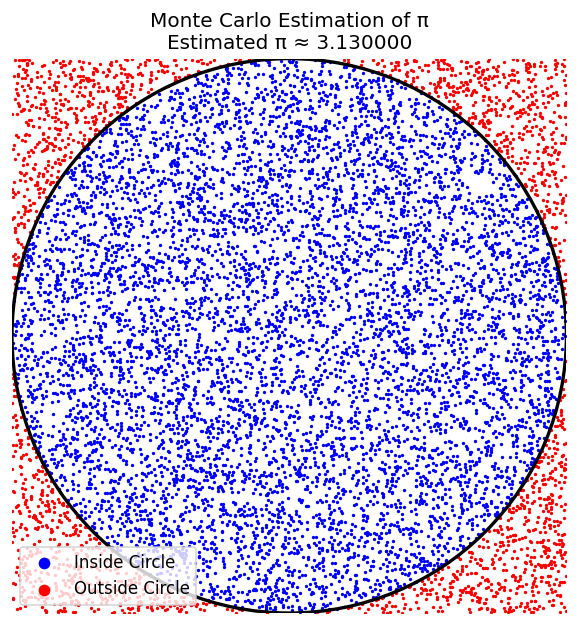
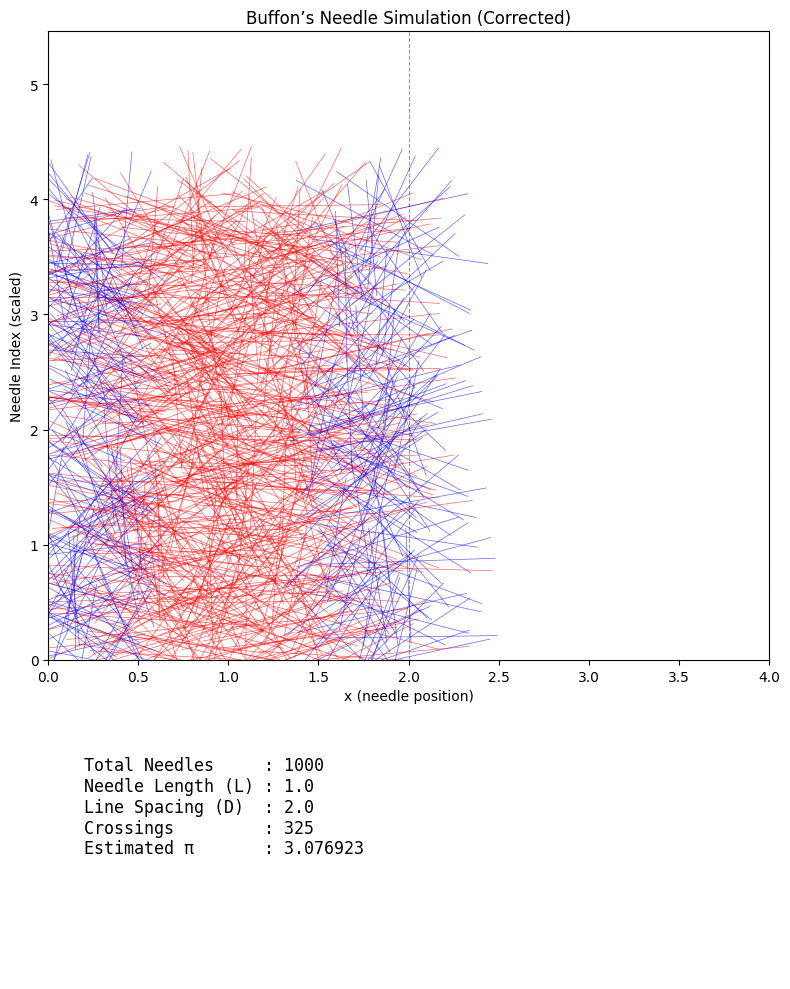

# Problem 2

# Circle-Based Method in Geometric Probability

## Overview

The **circle-based method** for estimating $\pi$ leverages *geometric probability*. By randomly scattering points within a square that encloses a circle, one can approximate the value of $\pi$ based on the ratio of points that fall inside the circle to the total number of points.

## Estimating $\pi$ via the Unit Circle

Consider a **unit circle** centered at the origin $(0,0)$, inscribed within a square of side length $2$. The square has area:

$$
A_{\text{square}} = (2)^2 = 4
$$

The area of the unit circle is:

$$
A_{\text{circle}} = \pi r^2 = \pi(1)^2 = \pi
$$

Hence, the probability $P$ that a point randomly chosen within the square lies inside the circle is:

$$
P = \frac{A_{\text{circle}}}{A_{\text{square}}} = \frac{\pi}{4}
$$

Thus, by randomly generating $N$ points within the square, the fraction $f$ of points falling inside the circle gives:

$$
f = \frac{N_{\text{in}}}{N} \approx \frac{\pi}{4} \Rightarrow \pi \approx 4f
$$

This forms the basis for the **Monte Carlo** method of $\pi$ estimation.

## Alternative Geometric Formulations

### Quarter-Circle in First Quadrant

Let us consider a **quarter-circle** of radius $1$ in the first quadrant, inscribed in a unit square $[0,1] \times [0,1]$. The area of the quarter-circle is:

$$
A_{\text{quarter-circle}} = \frac{\pi}{4}
$$

Probability of a point falling within the quarter-circle is again:

$$
P = \frac{\pi/4}{1} = \frac{\pi}{4}
$$

The formulation is equivalent, but this version reduces computation as all generated coordinates are in the positive quadrant.

### Generalization to Arbitrary Radius $r$

If the circle has radius $r$ and is inscribed in a square of side $2r$, then:

$$
\frac{A_{\text{circle}}}{A_{\text{square}}} = \frac{\pi r^2}{(2r)^2} = \frac{\pi r^2}{4r^2} = \frac{\pi}{4}
$$

The ratio remains independent of radius, reaffirming the robustness of the method under scaling.

## Impact of Non-Uniform Point Distributions

The assumption underlying the method is that points are **uniformly distributed** over the square. Let $p(x, y)$ be the probability density function (PDF) of the point distribution.

If $p(x, y) \neq \text{const.}$, then:

$$
P = \iint_{(x,y) \in \text{circle}} p(x,y) \, dx \, dy
$$

The empirical ratio no longer represents $\pi/4$, and estimation becomes biased.

### Example: Radial Bias

Let points be sampled with a radial bias towards the center:

$$
p(x,y) \propto \exp\left(-\alpha (x^2 + y^2)\right)
$$

The integral over the circular region increases relative to the uniform case, leading to **overestimation** of $\pi$.

## Statistical Error and Variance

Let $X_i$ be an indicator random variable:

$$
X_i =
\begin{cases}
1 & \text{if point $i$ is inside the circle} \\
0 & \text{otherwise}
\end{cases}
$$

Then:

- Expected value: $\mathbb{E}[X_i] = \frac{\pi}{4}$
- Variance: $\text{Var}(X_i) = \frac{\pi}{4} \left(1 - \frac{\pi}{4} \right)$

Let $\hat{\pi}_N = 4 \cdot \frac{1}{N} \sum_{i=1}^{N} X_i$, then by **Central Limit Theorem**:

$$
\hat{\pi}_N \sim \mathcal{N} \left( \pi, \frac{16}{N} \cdot \frac{\pi}{4} \left(1 - \frac{\pi}{4} \right) \right)
$$

Thus, the **standard error** of the estimate is:

$$
\text{SE}(\hat{\pi}_N) = \sqrt{ \frac{16}{N} \cdot \frac{\pi}{4} \left(1 - \frac{\pi}{4} \right) }
$$

## Conclusion

The circle-based method is a beautiful application of geometric probability. While simple and intuitive, its accuracy hinges on uniform sampling and grows slowly with $N$ due to statistical variance. Exploring alternative geometries and correcting for distributional biases remain rich avenues for refinement.

---

# Buffon’s Needle Method in Geometric Probability

## Classical Setup

Buffon's Needle is a classical problem in **geometric probability**, originally devised to estimate $\pi$. It involves dropping a needle of length $\ell$ onto a floor ruled with parallel lines spaced a distance $d$ apart $(\ell \leq d)$.

Let $\theta$ be the acute angle between the needle and the lines ($\theta \in [0, \frac{\pi}{2}]$), and let $x$ be the perpendicular distance from the needle's center to the nearest line ($x \in [0, \frac{d}{2}]$).

The needle crosses a line if:

$$
x \leq \frac{\ell}{2} \sin \theta
$$

Integrating over all valid $(x, \theta)$ pairs, the probability of a crossing is:

$$
P = \frac{2\ell}{\pi d}
$$

Thus, the estimate for $\pi$ becomes:

$$
\pi \approx \frac{2\ell N}{d N_{\text{cross}}}
$$

where $N$ is the total number of drops, and $N_{\text{cross}}$ is the number of crossings.

---

## Generalization: Variable Needle Length

When $\ell > d$, the geometry must accommodate needles longer than the line spacing. The probability of crossing becomes piecewise:

$$
P =
\begin{cases}
\frac{2\ell}{\pi d} & \text{if } \ell \leq d \\
\frac{2}{\pi} \left[ \frac{\ell}{d} - \sqrt{1 - \left(\frac{d}{\ell} \right)^2} + \arccos\left( \frac{d}{\ell} \right) \right] & \text{if } \ell > d
\end{cases}
$$

This more complex expression reflects how longer needles nearly always intersect a line unless they fall nearly parallel to the lines.

---

## Alternative Configurations

### 1. **Non-Uniform Line Spacing**

Suppose the spacing varies periodically or randomly: $d = d(x)$.

Then:

$$
P = \mathbb{E}_{x,\theta} \left[ \mathbb{I} \left( x \leq \frac{\ell}{2} \sin \theta \right) \cdot p_d(x) \right]
$$

where $p_d(x)$ is the probability density of line spacing at $x$.

### 2. **Non-Parallel or Grid Patterns**

For **grid lines** (vertical and horizontal):

- A crossing occurs if the needle intersects **either** set of lines.

Let $P_v$ and $P_h$ be probabilities of vertical and horizontal line crossings, then:

$$
P_{\text{grid}} = P_v + P_h - P_v P_h
$$

Each can be evaluated independently using Buffon's formula, as orientation affects projections along both axes.

### 3. **Curved or Finite-Length Lines**

If the lines are **curved** (e.g., concentric arcs) or of **finite length**, one must numerically integrate over local tangent angles and spatial inhomogeneities.

Let $\gamma(s)$ be a family of curve parameterizations, then crossing probability involves:

$$
P = \iint_{\text{needle domain}} \mathbb{I}(\text{intersect}(\gamma(s), \text{needle})) \, d\theta \, dx
$$

---

## Non-Ideal Needles

### 1. **Needle Thickness**

If needle has radius $r > 0$, the crossing condition becomes more generous:

$$
x \leq \frac{\ell}{2} \sin \theta + r
$$

This inflates the crossing probability and must be corrected for accurate $\pi$ estimation.

### 2. **Curved Needles**

For a **circular arc** of angle $\phi$ and radius $R$:

- Arc length: $\ell = R \phi$
- Projection geometry changes, requiring simulation or advanced integral geometry to evaluate $P(\text{cross})$.

---

## Convergence Analysis

### Buffon vs. Circle-Based Method

Let $X_i$ be the crossing indicator ($1$ if intersects, $0$ otherwise), then:

- Mean: $\mathbb{E}[X_i] = P$
- Variance: $\text{Var}(X_i) = P(1 - P)$

Let $\hat{\pi}_N$ be the estimate of $\pi$ using $N$ trials.

#### Buffon’s Method:

$$
\hat{\pi}_N = \frac{2\ell N}{d N_{\text{cross}}}
$$

Using the delta method for variance:

$$
\text{Var}(\hat{\pi}_N) \approx \left( \frac{\partial \hat{\pi}}{\partial N_{\text{cross}}} \right)^2 \text{Var}(N_{\text{cross}})
= \left( \frac{-2\ell N}{d N_{\text{cross}}^2} \right)^2 \cdot N P(1 - P)
$$

Thus, **variance decays as $1/N$**, but has a larger constant than in the circle-based method due to greater sensitivity to rare events (low $P$ when $\ell \ll d$).

#### Circle-Based Method:

- More robust to distributional noise
- Generally exhibits **lower variance for same $N$**, especially when using uniformly random $(x, y)$ coordinates

### Summary of Comparison

| Feature | Buffon’s Needle | Circle-Based Method |
|--------|------------------|---------------------|
| Variance | Higher (especially for short $\ell$) | Lower |
| Implementation | Simple with ruler | Easier with random $(x, y)$ |
| Extensions | Rich geometric possibilities | Limited to planar ratios |
| Bias Potential | Sensitive to misalignment or curvature | Sensitive to non-uniformity |

---

## Conclusion

Buffon’s Needle provides a profound historical example of geometric probability and $\pi$ estimation. While elegant, its practical use requires careful handling of geometry and error sources. Modern analyses generalize Buffon’s setup to a rich landscape of probabilistic geometry, offering fertile ground for research and simulation.

---

# General Theoretical Enhancements in Monte Carlo π Estimation

## 1. Broader Context: Monte Carlo Methods Across Disciplines

Both the **Circle-Based** and **Buffon’s Needle** methods are instances of **Monte Carlo integration**, where we estimate a quantity by averaging the outcomes of random samples. These techniques form the basis for methods used in:

- **Physics**: Path integrals in quantum mechanics, Ising models in statistical mechanics.
- **Finance**: Option pricing via stochastic differential equations (e.g., Black-Scholes).
- **Engineering**: Uncertainty quantification and robust design under probabilistic constraints.

The general form of Monte Carlo estimation is:

$$
\mathbb{E}[f(X)] \approx \frac{1}{N} \sum_{i=1}^{N} f(X_i)
$$

where $X_i$ are i.i.d. samples from a distribution and $f$ is a measurable function. In both π estimation methods, $f(X_i)$ is an **indicator function** for a geometric event (e.g., being inside a circle or crossing a line).

---

## 2. Unified Framework: Geometric Probability and π Estimation

Let $\Omega$ be a sample space of spatial configurations, with probability measure $\mathbb{P}$ defined over it. Define a geometric event $A$ such that:

$$
\mathbb{P}(A) = \frac{\pi}{4}
$$

for the circle method, or $= \frac{2\ell}{\pi d}$ in Buffon’s method.

Then define the random variable:

$$
Z_i = \mathbb{I}_{A}(X_i)
$$

and Monte Carlo estimation becomes:

$$
\hat{p} = \frac{1}{N} \sum_{i=1}^{N} Z_i \Rightarrow \pi \approx \mathcal{T}(\hat{p})
$$

where $\mathcal{T}$ is a **transformation function** mapping the estimated probability back to an estimate of $\pi$. For instance:

- Circle Method: $\mathcal{T}(p) = 4p$
- Buffon Method: $\mathcal{T}(p) = \frac{2\ell}{d p}$

Thus, both methods become specific instances of a general pipeline:

1. Define spatial probability space
2. Sample $X_i$
3. Evaluate indicator $Z_i$
4. Transform via $\mathcal{T}$ to estimate $\pi$

---

## 3. Computational Precision and Numerical Stability

Monte Carlo methods are sensitive to **floating-point errors**, especially when working with large $N$ or small probabilities.

### Issues:

- Finite-precision arithmetic introduces **round-off error** in trigonometric and square-root operations.
- **Catastrophic cancellation** occurs when subtracting nearly equal numbers (e.g., $\sqrt{1 - \epsilon}$).
- The **law of large numbers** converges slowly if error is not controlled.

### Model for Floating-Point Error Impact:

Let $\hat{\pi}_{\text{true}}$ be the ideal estimate and $\hat{\pi}_{\text{float}}$ be the computed one. Then:

$$
\hat{\pi}_{\text{float}} = \hat{\pi}_{\text{true}} + \epsilon_{\text{rand}} + \epsilon_{\text{fp}}
$$

where:
- $\epsilon_{\text{rand}}$ is sampling error ($\sim \mathcal{O}(1/\sqrt{N})$)
- $\epsilon_{\text{fp}}$ is computational error ($\sim \mathcal{O}(\varepsilon_{\text{machine}})$)

For IEEE-754 double precision, $\varepsilon_{\text{machine}} \approx 2^{-53} \approx 1.1 \times 10^{-16}$

---

## 4. Bayesian Refinement of π Estimates

Rather than using a point estimate, we may adopt a **Bayesian inference** approach to model uncertainty in $\pi$.

Let $Z_i \sim \text{Bernoulli}(p)$ with prior on $p$ given by:

$$
p \sim \text{Beta}(\alpha, \beta)
$$

The posterior is then:

$$
p \mid Z_1, \dots, Z_N \sim \text{Beta}(\alpha + S, \beta + N - S)
$$

where $S = \sum Z_i$ is the number of successes (circle hits or needle crossings).

Estimate of $\pi$ becomes a **posterior mean**:

- Circle Method:
  $$
  \mathbb{E}[\pi \mid \text{data}] = 4 \cdot \frac{\alpha + S}{\alpha + \beta + N}
  $$

- Buffon’s Method:
  $$
  \mathbb{E}[\pi \mid \text{data}] = \frac{2\ell}{d} \cdot \frac{\alpha + \beta + N}{\alpha + S}
  $$

### Advantages:

- Produces **credible intervals** rather than just point estimates
- Handles small $N$ robustly
- Can incorporate prior knowledge (e.g., we believe $\pi \in (3, 3.2)$)

---

## Summary Table

| Enhancement Type | Description | Implications |
|------------------|-------------|--------------|
| Cross-Domain Monte Carlo | Connection to physics, finance | Deepens understanding, extends utility |
| Unified Framework | Indicator-based probability estimation | Allows comparative analysis of methods |
| Floating-Point Model | Error decomposition into sampling and machine error | Guides implementation-level accuracy |
| Bayesian Refinement | Beta-binomial model for posterior $\pi$ | Offers uncertainty quantification |

---

## Conclusion

By embedding Circle-Based and Buffon’s Needle methods into the broader landscape of probabilistic modeling, we reveal deep connections to other domains and improve practical implementation. Bayesian and numerical models offer robust tools to quantify and reduce uncertainty — turning classical thought experiments into modern statistical machinery.

---

## Code and Plots



```python
import numpy as np
import matplotlib.pyplot as plt

# Set number of random points
N = 10000

# Generate random points in [-1, 1] x [-1, 1]
x = np.random.uniform(-1, 1, N)
y = np.random.uniform(-1, 1, N)

# Compute distances from origin
dist_sq = x**2 + y**2
inside = dist_sq <= 1

# Estimate π
pi_estimate = 4 * np.sum(inside) / N
print(f"Estimated π with {N} points: {pi_estimate:.6f}")

# Plotting
fig, ax = plt.subplots(figsize=(6, 6), dpi=120)

# Plot points
ax.scatter(x[inside], y[inside], color='blue', s=1, label='Inside Circle')
ax.scatter(x[~inside], y[~inside], color='red', s=1, label='Outside Circle')

# Circle boundary
circle = plt.Circle((0, 0), 1, edgecolor='black', facecolor='none', linewidth=2)
ax.add_patch(circle)

# Square boundary
ax.set_xlim(-1, 1)
ax.set_ylim(-1, 1)
ax.set_aspect('equal')
ax.set_title(f"Monte Carlo Estimation of π\nEstimated π ≈ {pi_estimate:.6f}")
ax.legend(loc='lower left', markerscale=6, frameon=True)

# Remove axes for clean appearance
ax.axis('off')

# Save high-resolution image (optional)
# plt.savefig("monte_carlo_pi_estimate.png", dpi=300, bbox_inches='tight')

plt.show()
```
---



```python
import numpy as np
import matplotlib.pyplot as plt

# Simulation parameters
N = 1000                # Number of needle drops
needle_length = 1.0      # Length of the needle (L)
line_spacing = 2.0       # Distance between parallel lines (D)

assert needle_length <= line_spacing, "Buffon's Needle assumes L ≤ D"

# Sample needle centers and angles
x_centers = np.random.uniform(0, line_spacing, N)
theta = np.random.uniform(0, np.pi, N)  # Uniform angle in [0, π]

# Distance from center to nearest line (in x-direction)
x_dist_to_nearest_line = np.minimum(x_centers % line_spacing, line_spacing - (x_centers % line_spacing))

# Determine if needle crosses a line (projection method)
crosses = (needle_length / 2) * np.sin(theta) >= x_dist_to_nearest_line
num_crosses = np.sum(crosses)

# Estimate π
if num_crosses > 0:
    pi_estimate = (2 * needle_length * N) / (line_spacing * num_crosses)
else:
    pi_estimate = np.nan

print(f"Estimated π with {N} needles: {pi_estimate:.6f} ({num_crosses} crossings)")

# Visualization
fig, axs = plt.subplots(2, 1, figsize=(8, 10), gridspec_kw={'height_ratios': [3, 1]})
ax1, ax2 = axs

# Generate full needle endpoints for plotting
x1 = x_centers - (needle_length / 2) * np.cos(theta)
x2 = x_centers + (needle_length / 2) * np.cos(theta)
y_centers = np.arange(N) / 250  # for vertical spreading
y1 = y_centers - (needle_length / 2) * np.sin(theta)
y2 = y_centers + (needle_length / 2) * np.sin(theta)

# Plot needles
for i in range(N):
    color = 'blue' if crosses[i] else 'red'
    ax1.plot([x1[i], x2[i]], [y1[i], y2[i]], color=color, linewidth=0.5, alpha=0.6)

# Draw vertical parallel lines
max_x = max(np.max(x1), np.max(x2)) + 1
n_lines = int(max_x // line_spacing) + 2
for i in range(n_lines):
    ax1.axvline(i * line_spacing, color='black', linestyle='--', linewidth=0.8, alpha=0.4)

# Formatting
ax1.set_title("Buffon’s Needle Simulation (Corrected)")
ax1.set_xlim(0, line_spacing * (n_lines - 1))
ax1.set_ylim(0, np.max(y2) + 1)
ax1.set_xlabel("x (needle position)")
ax1.set_ylabel("Needle Index (scaled)")
ax1.set_aspect('auto')
ax1.grid(False)

# Dashboard text
ax2.axis('off')
summary = f"""
Total Needles     : {N}
Needle Length (L) : {needle_length}
Line Spacing (D)  : {line_spacing}
Crossings         : {num_crosses}
Estimated π       : {pi_estimate:.6f}
"""
ax2.text(0.05, 0.5, summary, fontsize=12, family='monospace')

plt.tight_layout()
plt.show()
```


[Colab](https://colab.research.google.com/drive/1CxIAL0rVCu3h2mnSKswsMCUmySqOmfD0#scrollTo=GgokTFIFmWSK)
