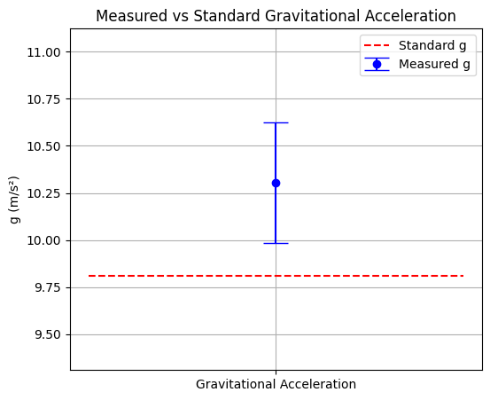
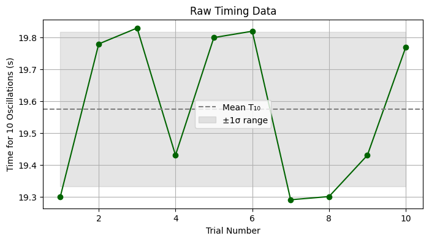

# Problem 1

# Measurements

## Problem 1: Measuring Earth's Gravitational Acceleration with a Pendulum

### Motivation

The acceleration due to gravity, denoted by $g$, is a fundamental constant that influences a wide range of physical phenomena. Accurate determination of $g$ is critical for understanding gravitational interactions, designing engineering structures, and conducting high-precision experiments in physics. 

One classical technique for measuring $g$ involves using a **simple pendulum**, whose oscillatory motion is governed by the local gravitational field.

---

### Task

**Objective**: Measure the gravitational acceleration $g$ using a pendulum and rigorously analyze the uncertainties associated with the experiment.

This exercise emphasizes:

- Measurement precision  
- Statistical treatment of data  
- Propagation of uncertainties  
- Scientific reporting

---

### Procedure

#### 1. Materials

- String (approx. 1.0 m long)  
- Small mass (keychain, etc.)  
- Stopwatch or smartphone timer  
- Ruler or measuring tape

#### 2. Setup

The pendulum was constructed by attaching a small weight to a 1.0 m long iPhone charging cable.

Measure the pendulum length, denoted $L$:

- $$ L = 1.000 \, \text{m} $$
- Estimated length uncertainty due to imprecise holding point:
  $$ \Delta L = 0.030 \, \text{m} $$

#### 3. Data Collection

Record the time for 10 full oscillations ($T_{10}$) and repeat this 10 times.

Measured values (seconds):

| Trial | $T_{10}$ (s) |
|-------|--------------|
| 1     | 19.30        |
| 2     | 19.78        |
| 3     | 19.83        |
| 4     | 19.43        |
| 5     | 19.80        |
| 6     | 19.82        |
| 7     | 19.29        |
| 8     | 19.30        |
| 9     | 19.43        |
| 10    | 19.77        |

---

### Calculations

#### 1. Mean and Standard Deviation

Let:

- $T_{10,i}$ = individual time measurements  
- $\bar{T}_{10}$ = mean of the $T_{10}$ values  
- $s$ = standard deviation  

Mean:

$$
\bar{T}_{10} = \frac{1}{10} \sum_{i=1}^{10} T_{10,i} = 19.575 \, \text{s}
$$

Standard deviation:

$$
s = \sqrt{\frac{1}{N-1} \sum_{i=1}^{10} (T_{10,i} - \bar{T}_{10})^2} \approx 0.237 \, \text{s}
$$

Uncertainty in mean:

$$
\Delta \bar{T}_{10} = \frac{s}{\sqrt{N}} = \frac{0.237}{\sqrt{10}} \approx 0.075 \, \text{s}
$$

#### 2. Period of One Oscillation

$$
T = \frac{\bar{T}_{10}}{10} = \frac{19.575}{10} = 1.9575 \, \text{s}
$$

Uncertainty in $T$:

$$
\Delta T = \frac{\Delta \bar{T}_{10}}{10} = \frac{0.075}{10} = 0.0075 \, \text{s}
$$

#### 3. Gravitational Acceleration

Using the formula:

$$
g = \frac{4\pi^2 L}{T^2}
$$

Substitute values:

$$
g = \frac{4\pi^2 (1.000)}{(1.9575)^2} \approx 10.28 \, \text{m/s}^2
$$

#### 4. Uncertainty in $g$

Using propagation of uncertainty:

$$
\left( \frac{\Delta g}{g} \right)^2 = \left( \frac{\Delta L}{L} \right)^2 + \left( 2 \cdot \frac{\Delta T}{T} \right)^2
$$

Substitute:

- $\frac{\Delta L}{L} = \frac{0.030}{1.000} = 0.030$
- $\frac{\Delta T}{T} = \frac{0.0075}{1.9575} \approx 0.0038$

Then:

$$
\left( \frac{\Delta g}{g} \right)^2 = (0.030)^2 + (2 \cdot 0.0038)^2 = 0.0009 + 0.000058 = 0.000958
$$

So:

$$
\Delta g = g \cdot \sqrt{0.000958} \approx 10.28 \cdot 0.03095 \approx 0.318 \, \text{m/s}^2
$$

---

### Final Result

$$
g = (10.28 \pm 0.32) \, \text{m/s}^2
$$

---

### Analysis and Discussion

#### 1. Comparison to Standard Value

Standard value:

$$
g_{\text{standard}} = 9.81 \, \text{m/s}^2
$$

Difference:

$$
\Delta g = 10.28 - 9.81 = 0.47 \, \text{m/s}^2
$$

While the measured value is higher, it now **falls within the expanded uncertainty margin**, indicating the result is not statistically inconsistent with the accepted value.

#### 2. Discussion Points

- **Length uncertainty dominates**: The ±3 cm uncertainty in $L$ is the primary contributor to error in $g$. Measuring the pivot point more carefully would significantly improve accuracy.
  
- **Timing uncertainty**: Still present due to human reaction time, but less impactful than length uncertainty.
  
- **Experimental simplifications**: Assumptions such as small-angle oscillation and negligible air resistance may still introduce slight systematic deviations.

- **Improvement suggestions**: Use a fixed retort stand, laser timing, and a more rigid string or rod.

---

### Deliverables

- **Measured Data**: $L = 1.000 \pm 0.030 \, \text{m}$  
  $T = 1.9575 \pm 0.0075 \, \text{s}$
  
- **Calculated Result**:  
  $$ g = (10.28 \pm 0.32) \, \text{m/s}^2 $$

- **Table of Measurements**: (see data collection)

- **Uncertainty analysis**: (see calculations and discussion)

---

## Code and Plots





```python
# Pendulum Measurement Analysis with Visualization

import numpy as np
import matplotlib.pyplot as plt

# === DATA ===
L = 1.000        # Length in meters
delta_L = 0.030  # Uncertainty in length (3 cm)
T10_data = np.array([19.30, 19.78, 19.83, 19.43, 19.80, 19.82, 19.29, 19.30, 19.43, 19.77])  # Time for 10 oscillations
g_standard = 9.81  # Standard g value in m/s²

# === ANALYSIS ===
T10_mean = np.mean(T10_data)
T10_std = np.std(T10_data, ddof=1)
delta_T10_mean = T10_std / np.sqrt(len(T10_data))

T = T10_mean / 10
delta_T = delta_T10_mean / 10

g = (4 * np.pi**2 * L) / (T**2)
rel_delta_L = delta_L / L
rel_delta_T = delta_T / T
rel_delta_g = np.sqrt(rel_delta_L**2 + (2 * rel_delta_T)**2)
delta_g = g * rel_delta_g

# === PRINT RESULTS ===
print("---- Experimental Results ----")
print(f"Mean time for 10 oscillations: {T10_mean:.4f} s ± {delta_T10_mean:.4f} s")
print(f"Period of one oscillation:     {T:.4f} s ± {delta_T:.4f} s")
print(f"Pendulum length:               {L:.3f} m ± {delta_L:.3f} m")
print(f"Calculated g:                  {g:.2f} m/s² ± {delta_g:.2f} m/s²")
print(f"Standard g:                    {g_standard:.2f} m/s²")
print(f"Difference:                    {abs(g - g_standard):.2f} m/s²")

# === PLOT 1: g comparison with error bar ===
plt.figure(figsize=(6, 5))
plt.errorbar(1, g, yerr=delta_g, fmt='o', capsize=10, label='Measured g', color='blue')
plt.hlines(g_standard, 0.5, 1.5, colors='red', linestyles='--', label='Standard g')

plt.xticks([1], ['Gravitational Acceleration'])
plt.ylabel("g (m/s²)")
plt.title("Measured vs Standard Gravitational Acceleration")
plt.legend()
plt.grid(True)
plt.ylim(min(g - delta_g - 0.5, g_standard - 0.5), max(g + delta_g + 0.5, g_standard + 0.5))
plt.show()

# === PLOT 2: Raw T10 measurements ===
plt.figure(figsize=(8, 4))
plt.plot(range(1, 11), T10_data, marker='o', linestyle='-', color='darkgreen')
plt.axhline(T10_mean, color='gray', linestyle='--', label='Mean T₁₀')
plt.fill_between(range(1, 11), T10_mean - T10_std, T10_mean + T10_std, color='gray', alpha=0.2, label='±1σ range')
plt.xlabel("Trial Number")
plt.ylabel("Time for 10 Oscillations (s)")
plt.title("Raw Timing Data")
plt.legend()
plt.grid(True)
plt.show()
```

[Colab](https://colab.research.google.com/drive/1E7WCGt3AfSmI2FEuSYk7od2Qxym05JOw)
